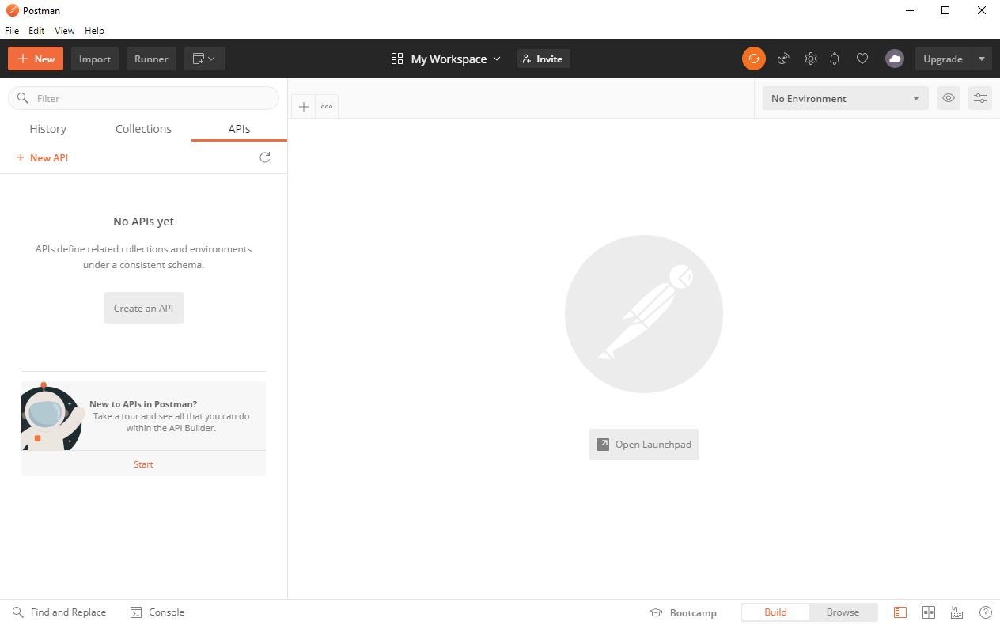
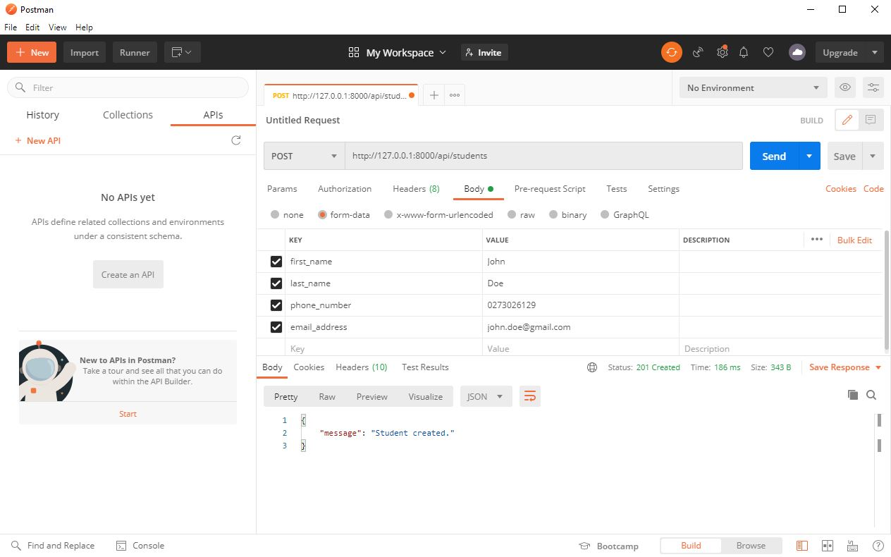
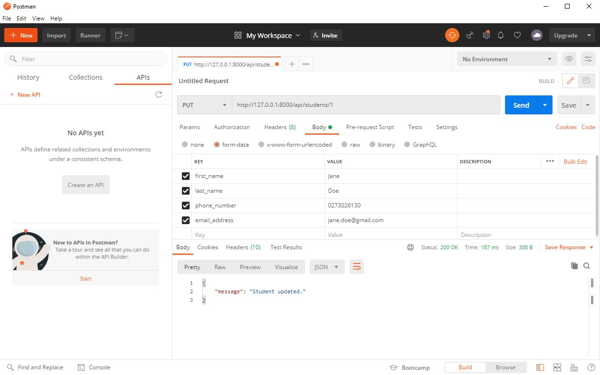
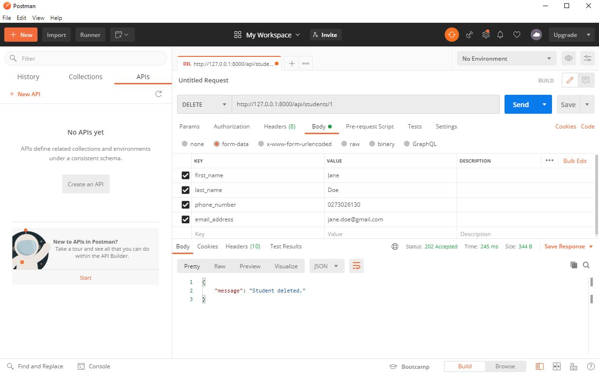
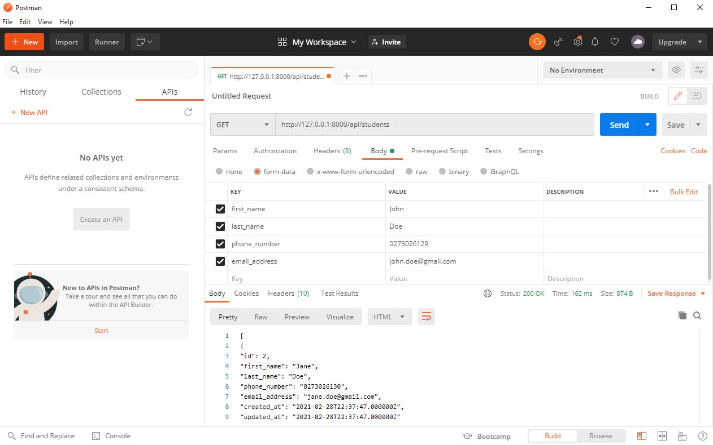
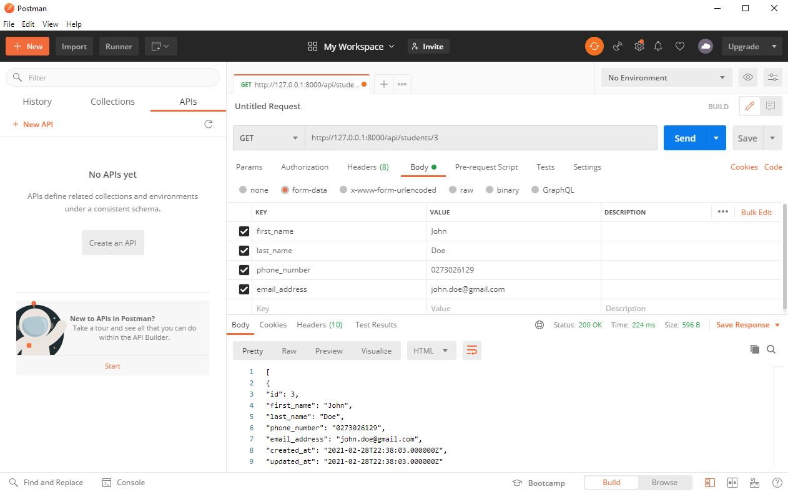

# Laravel 1 - REST APIs & Postman

## Laragon
Like [Laravel Homestead](https://laravel.com/docs/8.x/homestead) & [XAMPP](https://www.apachefriends.org/index.html), [Laragon](https://laragon.org/) is a development environment for [PHP](https://www.php.net/). Laragon makes building and maintaining applications simple. If you do not have Laragon installed, you can download it [here](https://laragon.org/download/).

## Creating a Laravel Application
Open the Laragon application. You will be presented with the following window (Fig.1).

<figure>
    
    <figcaption>Fig.1 - Laragon startup window.</figcaption>
</figure>

</br>Click the **Start All** button. This will start an [Apache](https://httpd.apache.org/) HTTP server & [MySQL](https://www.mysql.com/) database (Fig.2).

<figure>
    
    <figcaption>Fig.2 - Starting Apache & MySQL.</figcaption>
</figure>

</br>**Right-click > Quick app > Laravel**. You will be presented with another window asking you to name your application. Once you have named your application, click the **OK** button (Fig.3).

**Note:** You can not create a new application until Apache & MySQL have been started.

<figure>
    
    <figcaption>Fig.3 - Naming the Laravel application api.</figcaption>
</figure>

</br>You will find all applications in the `laragon\www` directory.

## Model

In Laravel, you can create a new model & migration by running the following command:

```php
php artisan make:model Student -m
```

Go to the `app` directory. A file called `Learner.php` has been created. In `Learner.php`, specify the database table and its field you wish to interact with. For example:

```php
...
class Student extends Model {
    use HasFactory;

    protected $table = 'students';

    protected $fillable = ['first_name', 'last_name', 'phone_number', 'email_address'];
}
```

## Migrations
In the `database/migrations` directory, you will see a new migration file (newest timestamp) which has created a database table, i.e., `students`. 

```php
...
public function up() {
    Schema::create('students', function (Blueprint $table) {
        $table->increments('id');
        $table->timestamps();
    });
}
...
```

Modify this migration file by adding a column for `first_name`, `last_name`,`phone_number` & `email_address`. All four columns are of type `string`.

```php
...
public function up() {
    Schema::create('students', function (Blueprint $table) {
        $table->increments('id');
        $table->string('first_name');
        $table->string('last_name');
        $table->string('phone_number');
        $table->string('email_address');
        $table->timestamps();
    });
}
...
```

## Connecting to MySQL
In `.env` file, modify your database credentials so which your project connects to MySQL locally. You will look at how to connect to a cloud database at a later date.
```php
DB_CONNECTION=mysql
DB_HOST=127.0.0.1
DB_PORT=3306
DB_DATABASE=api
DB_USERNAME=root
DB_PASSWORD=
```

**Note:** You **do not** need a password to use this database.

If you make a change to any model, you must run a migration using the following command:

```php
php artisan migrate
```

## REST APIs
What is a REST API? This [YouTube video](https://www.youtube.com/watch?v=SLwpqD8n3d0) by [Programming with Mosh](https://programmingwithmosh.com/) explains it in six minutes.

## Controller
You will create a controller which will contain the [CRUD](https://developer.mozilla.org/en-US/docs/Glossary/CRUD) methods for your [API](https://developer.mozilla.org/en-US/docs/Glossary/API). However, before you create a controller, you must have a general understanding on what it is.

A [Controller](https://laravel.com/docs/8.x/controllers) class contains public action methods used to handle various [HTTP requests methods](https://developer.mozilla.org/en-US/docs/Web/HTTP/Methods), i.e., `GET`, `POST`, `PUT` & `DELETE`. These action methods handle incoming requests, retrieve the necessary model data & return the appropriate response.

To create a new controller, run the following command:

```php
php artisan make:controller ApiController
```

In the `app\Http\Controllers` directory, you will find all your controllers including `ApiController.php`. 

In `ApiController.php`, add the following CRUD methods:

```php
...
class ApiController extends Controller {
    public function createStudent(Request $request) {
    }

    public function updateStudent(Request $request, $id) {
    }

    public function deleteStudent($id) {
    }

    public function getAllStudents() {
    }
    
    public function getStudent($id) {
    }
}
```
In order to use the `students` data table, you need to import the `Student` model. To do this, add the following line above the class declaration:

```php
...
use App\Models\Student;

class ApiController extends Controller {
    ...
}
```

### Eloquent
[Eloquent](https://laravel.com/docs/8.x/eloquent) is an ORM that allows you to convert data between incompatible type systems using an OO programming language. 

### Create a Student

```php
...
public function createStudent(Request $request) {
    $student = new Student;
    $student->first_name = $request->first_name;
    $student->last_name = $request->last_name;
    $student->phone_number = $request->phone_number;
    $student->email_address = $request->email_address;
    $student->save();
    return response()->json(["message" => "Student created."], 201);
}
...
```

- Instantiates a new `Request` in the `createStudent()` parameter.
- Instantiates a new `Student` in the `createStudent()` method block.
- Fetches & saves the `Student`'s data from the request.
- Returns a [JSON](https://developer.mozilla.org/en-US/docs/Glossary/JSON) `Response` containing a message which indicates the `Student` was created & a status response code of [201](https://developer.mozilla.org/en-US/docs/Web/HTTP/Status/201). 

### Update a Student

```php
...
public function updateStudent(Request $request, $id) {
    if (Student::where('id', $id)->exists()) {
        $student = Student::find($id);
        $student->first_name = is_null($request->first_name) ? $student->first_name : $request->first_name;
        $student->last_name = is_null($request->last_name) ? $student->last_name : $request->last_name;
        $student->phone_number = is_null($request->phone_number) ? $student->phone_number : $request->phone_number;
        $student->email_address = is_null($request->email_address) ? $student->email_address : $request->email_address;
        $student->save();
        return response()->json(["message" => "Student updated."], 200);
    } else {
        return response()->json(["message" => "Student not found."], 404);    
    }
}
...
```

- Instantiates a new `Request` in the `updateStudent()` parameter.
- Retrieves the `id` in the `updateStudent()` parameter.
- Checks if the `Student` to update exists:
   - If `true`, finds the `Student` which matches the `id` & checks if any of its data `is_null()`. If `is_null()`, replaces & saves the request with its existing value. Otherwise, replaces & saves the request with the new value. Also, returns a JSON `Response` containing a message which indicates the `Student` was updated & a status response code of [200](https://developer.mozilla.org/en-US/docs/Web/HTTP/Status/200).  
   - If `false`, returns a JSON `Response` containing a message which indicates the `Student` was not found & a status response code of [404](https://developer.mozilla.org/en-US/docs/Web/HTTP/Status/404). 

### Delete a Student
```php
...
public function deleteStudent($id) {
    if(Student::where('id', $id)->exists()) {
        $student = Student::find($id);
        $student->delete();
        return response()->json(["message" => "Student deleted."], 202);
    } else {
        return response()->json(["message" => "Student not found."], 404);
    }
}
...
```

- Retrieves the `id` in the `deleteStudent()` parameter.
- Checks if the `Student` to retrieve exists:
   - If `true`, finds & deletes the `Student` which matches the `id`. Also, returns a JSON `Response` containing a message which indicates the `Student` was deleted & a status response code of [202](https://developer.mozilla.org/en-US/docs/Web/HTTP/Status/202). 
   - If `false`, returns a JSON `Response` containing a message which indicates the `Student` was not found & a status response code of 404. 

### Get All Students
```php
...
public function getAllStudents() {
    $students = Student::get()->toJson(JSON_PRETTY_PRINT);
    return response($students, 200);
}
...
```

- Retrieves all `Students` & serializes its data into a JSON format.
- Returns a `Response` containing the retrieved `Students` & a status response code of 200. 

### Get One Student

```php
...
public function getStudent($id) {
    if (Student::where('id', $id)->exists()) {
        $student = Student::where('id', $id)->get()->toJson(JSON_PRETTY_PRINT);
        return response($student, 200);
    } else {
        return response()->json(["message" => "Student not found."], 404);
    }
}
```

- Retrieves the `id` in the `getStudent()` parameter.
- Checks if the `Student` to retrieve exists:
   - If `true`, retrieves the `Student` which matches the `id` & serialize its data into a JSON format. Also, returns a `Response` containing the retrieved `Student` & a status response code of 200.
   - If `false`, returns a JSON `Response` containing a message which indicates the `Student` was not found & a status response code of 404. 
   
## Routes

In the `routes` directory, open the `api.php` file & create the following API endpoint:

```php
Route::group(['prefix' => 'students'], function() {
    Route::post('/', 'ApiController@createStudent');
    Route::put('/{id}', 'ApiController@updateStudent');
    Route::delete('/{id}', 'ApiController@deleteStudent');
    Route::get('/', 'ApiController@getAllStudents');
    Route::get('/{id}', 'ApiController@getStudent');
});
```

**Note:** All routes in `api.php` are prefix with `/api`.

In the `app\Providers\RouteServiceProvider` directory, uncomment line 29. Please read the comments for more detail.

## Run Development Server
You can run the development server by running the following command:
```php
php artisan serve
```

## Postman
[Postman](https://www.postman.com/) is an API development environment that allows you to design, mock & test your APIs. If you do not have Postman installed, you can download it [here](https://www.postman.com/downloads/).

Open the Postman application. You will be presented with the following window (Fig.4).

<figure>
    
    <figcaption>Fig.4 - Postman startup window.</figcaption>
</figure>

### Test your API Endpoints

Click on the **+ (plus)** button to create a new request.

To create a `Student`, change the HTTP method to `POST`, enter the URL - `http//127.0.0.1:8000/api/students`, change to the **Body** tab, click the **form-data** radio button, enter the `Student` data & click the **Send** button (Fig.5).

<figure>
    
    <figcaption>Fig.5 - Creating a new student named John Doe.</figcaption>
</figure>

</br>To update a `Student`, change the HTTP method to `PUT`, enter the URL - `http//127.0.0.1:8000/api/students/1`, update the `Student` data & click the **Send** button.

<figure>
    
    <figcaption>Fig.6 - Updating John's first name & email address.</figcaption>
</figure>

</br>To update a `Student`, change the HTTP method to `DELETE`, enter the URL - `http//127.0.0.1:8000/api/students/1` & click the **Send** button.

<figure>
    
    <figcaption>Fig.7 - Deleting Jane.</figcaption>
</figure>

</br>Now you know how to create a `Student`, add two `Students`.

To get all `Students`, change the HTTP method to `GET`, enter the URL - `http//127.0.0.1:8000/api/students` & click the **Send** button.

<figure>
    
    <figcaption>Fig.8 - Getting all students.</figcaption>
</figure>

</br>To get a `Student`, change the HTTP method to `GET`, enter the URL - `http//127.0.0.1:8000/api/students/2` & click the **Send** button.

<figure>
    
    <figcaption>Fig.9 - Getting the student with the id 3.</figcaption>
</figure>
