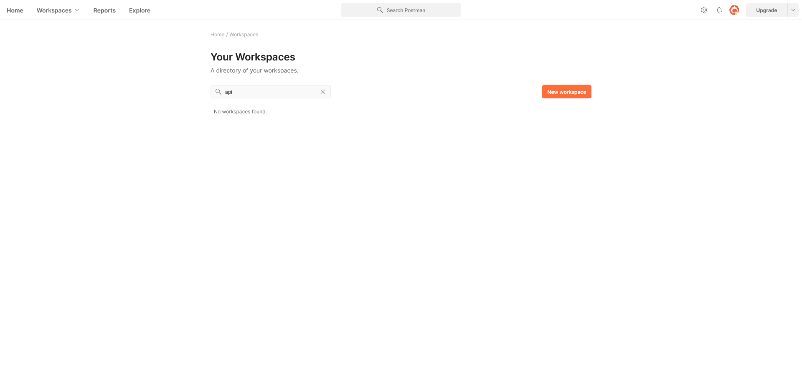
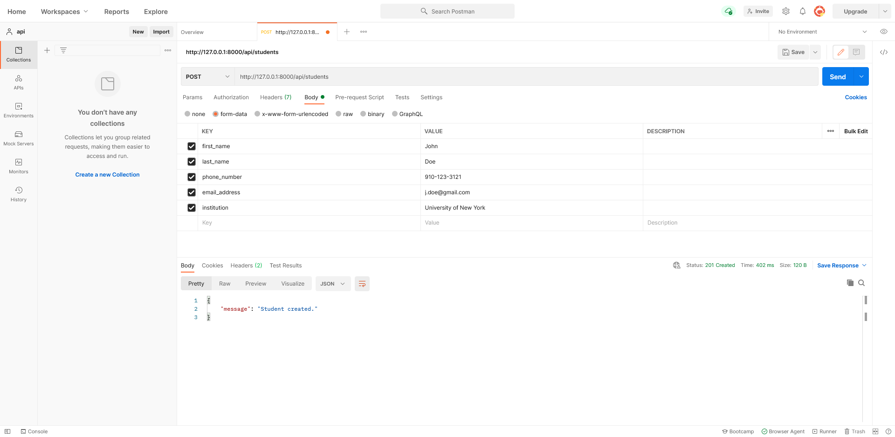
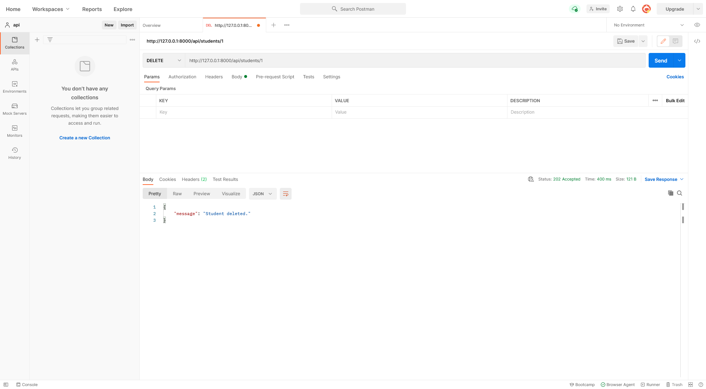
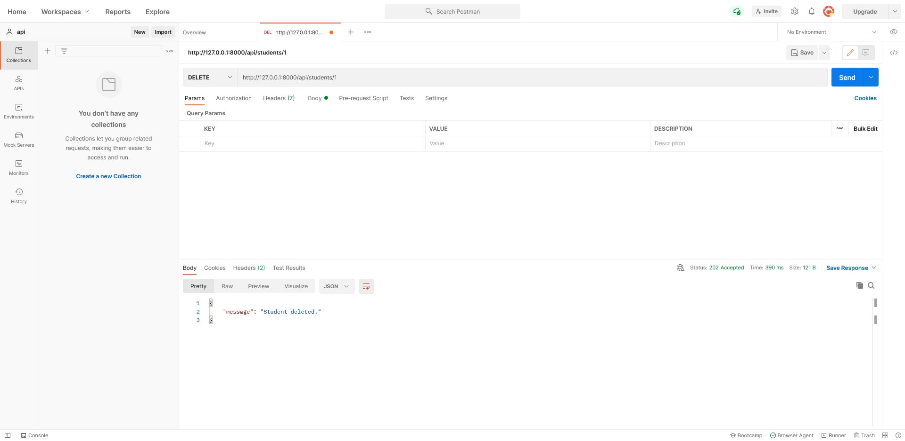
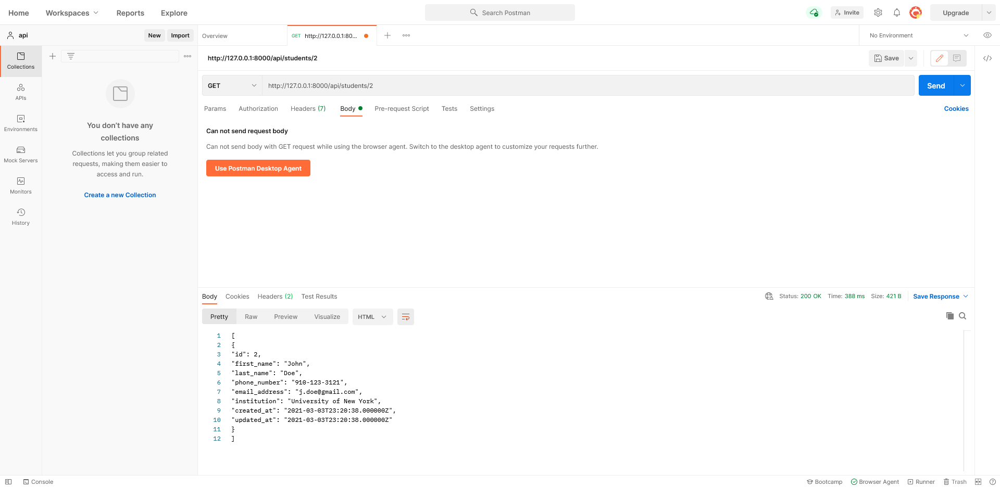
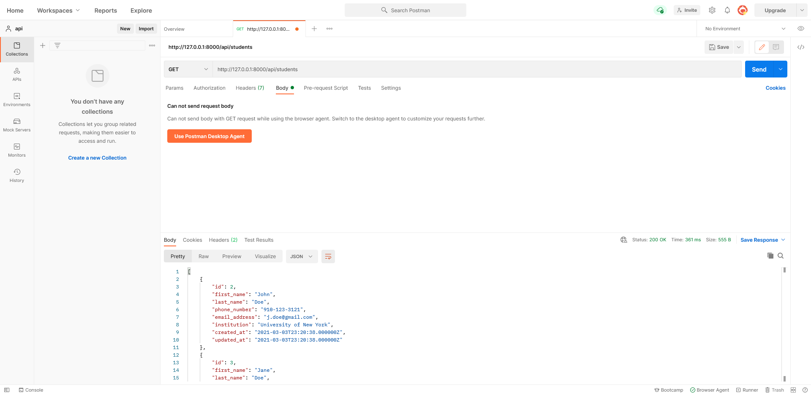

# Laravel 1 - REST APIs & Postman

## Laragon
Like [Laravel Homestead](https://laravel.com/docs/8.x/homestead) & [XAMPP](https://www.apachefriends.org/index.html), [Laragon](https://laragon.org/) is a development environment for [PHP](https://www.php.net/). **Laragon** makes building and maintaining applications simple. If you do not have **Laragon** installed, you can download it [here](https://laragon.org/download/). 

**Note:** The following documentation is specific for **Windows**. If you are using **macOS** or **Linux**, you will need to use **XAMMP** as there is no **Largon** client for **macOS** or **Linux**.

## Creating a Laravel Application
Open the **Laragon** application. You will be presented with the following window.

<figure>
    
</figure>

</br>Click the **Start All** button. This will start an [Apache](https://httpd.apache.org/) HTTP server & [MySQL](https://www.mysql.com/) database.

<figure>
    
</figure>

</br>**Right-click > Quick app > Laravel**. You will be presented with another window prompting you to name the application. Once named, click the **OK** button.

**Note:** An application can not be created until **Apache** & **MySQL** have been started.

<figure>
    
</figure>

</br>All applications are in the `laragon\www` directory.

`cd` to the **api** project.

## Model

A **Model** class represents the logical structure & relationship of a database table. In **Laravel**, each table corresponds to a [model](https://laravel.com/docs/8.x/eloquent#generating-model-classes). A **model** allows you to retrieve, create, update & delete data.

To create a new **model** & migration, execute the following command:

```php
php artisan make:model Student -m
```

The `-m` flag creates a migration. 

In `app\Models\Student.php`, specify the database table and fields you wish to interact with. For example:

```php
...
class Student extends Model {
    use HasFactory;

    protected $table = 'students';

    protected $fillable = ['first_name', 'last_name', 'phone_number', 'email_address'];
}
```

## Migrations
In the `database\migrations` directory, you will see a new migration file which has created a database table, i.e., `students`. 

```php
...
public function up() {
    Schema::create('students', function (Blueprint $table) {
        $table->increments('id');
        $table->timestamps();
    });
}
...
```

Modify this migration file by adding a column for `first_name`, `last_name`,`phone_number` & `email_address`. All four columns are of type `string`.

```php
...
public function up() {
    Schema::create('students', function (Blueprint $table) {
        $table->increments('id');
        $table->string('first_name');
        $table->string('last_name');
        $table->string('phone_number');
        $table->string('email_address');
        $table->timestamps();
    });
}
...
```

## Connecting to MySQL
In the `.env` file, modify your database credentials so that your project connects to **MySQL**.
```php
DB_CONNECTION=mysql
DB_HOST=127.0.0.1
DB_PORT=3306
DB_DATABASE=api
DB_USERNAME=root
DB_PASSWORD=
```

**Note:** You **do not** need a password to use this database. 

If you make a change to any **model**, you must make a migration using the following command:

```php
php artisan migrate
```

## REST APIs
What is a **REST API**? This [YouTube video](https://www.youtube.com/watch?v=SLwpqD8n3d0) by [Programming with Mosh](https://programmingwithmosh.com/) explains it in six minutes.

## Controller
You will create a **controller** which will contain the [CRUD](https://developer.mozilla.org/en-US/docs/Glossary/CRUD) methods for your [API](https://developer.mozilla.org/en-US/docs/Glossary/API). However, before you create a **controller**, you must have a general understanding on what a **controller** is.

A [Controller](https://laravel.com/docs/8.x/controllers) class contains public action methods used to handle various [HTTP requests methods](https://developer.mozilla.org/en-US/docs/Web/HTTP/Methods), i.e., `GET`, `POST`, `PUT` & `DELETE`. These action methods handle incoming requests, retrieve the necessary **model** data & return the appropriate responses. 

To create a new **controller**, execute the following command:

```php
php artisan make:controller ApiController
```

In the `app\Http\Controllers` directory, you will find all your **controllers** including `ApiController.php`. 

In `ApiController.php`, add the following **CRUD** methods:

```php
...
class ApiController extends Controller {
    public function createStudent(Request $request) {
    }

    public function updateStudent(Request $request, $id) {
    }

    public function deleteStudent($id) {
    }

    public function getAllStudents() {
    }
    
    public function getStudent($id) {
    }
}
```

In order to use the `students` table, you need to import the `Student` **model**. To do this, add the following line above the class declaration:

```php
...
use App\Models\Student;

class ApiController extends Controller {
    ...
}
```

### Eloquent
[Eloquent](https://laravel.com/docs/8.x/eloquent) is an **Object-Relational Mapping (ORM)** that allows you to query & manipulate data using an **Object-Oriented** programming language. Each **web framework** has one or more **ORMs** which encapsulate the code needed to query & manipulate data so that you do not need to use **SQL**. You interact directly with an object in the same programming language you are using, i.e., **PHP**.

### Create a Student

```php
...
public function createStudent(Request $request) {
    Student::create($request->all());
    return response()->json(["message" => "Student created."], 201);
}
...
```

```sql
-- SQL equivalent:
INSERT INTO students (first_name, last_name, phone_number, email_address) 
VALUES (?, ?, ?, ?);
```

- Instantiate a new `Request` in the `createStudent()` parameter.
- Fetch & save the `Student`'s data from the request.
- Return a [JSON](https://developer.mozilla.org/en-US/docs/Glossary/JSON) `Response` containing a message which indicates the `Student` has been created & a status response code of [201](https://developer.mozilla.org/en-US/docs/Web/HTTP/Status/201). 

### Update a Student

```php
...
public function updateStudent(Request $request, $id) {
    $students = Student::query();
    if ($students->where('id', $id)->exists()) {
        $student = $students->find($id);
        $student->first_name = is_null($request->first_name) ? $student->first_name : $request->first_name;
        $student->last_name = is_null($request->last_name) ? $student->last_name : $request->last_name;
        $student->phone_number = is_null($request->phone_number) ? $student->phone_number : $request->phone_number;
        $student->email_address = is_null($request->email_address) ? $student->email_address : $request->email_address;
        $student->save();
        return response()->json(['message' => 'Student updated.'], 200);
    } else {
        return response()->json(['message' => 'Student not found.'], 404);
    }
}
...
```

```sql
-- SQL equivalent:
UPDATE students
SET first_name=?, SET last_name=?, SET phone_number=?, SET email_address=?
WHERE id=?;
```

- Instantiate a new `Request` in the `updateStudent()` parameter.
- Retrieve the `id` in the `updateStudent()` parameter.
- Check if the `Student` to update exists:
   - If `true`, find the `Student` which matches the `id` & check if any of its data `is_null()`. If `is_null()`, replace & save the request with its existing value. Otherwise, replace & save the request with the new value. Also, return a **JSON** `Response` containing a message which indicates the `Student` has been updated & a status response code of [200](https://developer.mozilla.org/en-US/docs/Web/HTTP/Status/200).  
   - If `false`, return a **JSON** `Response` containing a message which indicates the `Student` has not been found & a status response code of [404](https://developer.mozilla.org/en-US/docs/Web/HTTP/Status/404). 

### Delete a Student
```php
...
public function deleteStudent($id) {
    $students = Student::query();
    if ($students->where('id', $id)->exists()) {
        $student = $students->find($id);
        $student->delete();
        return response()->json(['message' => 'Student deleted.'], 202);
    } else {
        return response()->json(['message' => 'Student not found.'], 404);
    }
}
...
```

```sql
-- SQL equivalent:
DELETE FROM students 
WHERE id=?;
```

- Retrieve the `id` in the `deleteStudent()` parameter.
- Check if the `Student` to retrieve exists:
   - If `true`, find & delete the `Student` which matches the `id`. Also, return a **JSON** `Response` containing a message which indicates the `Student` has been deleted & a status response code of [202](https://developer.mozilla.org/en-US/docs/Web/HTTP/Status/202). 
   - If `false`, return a **JSON** `Response` containing a message which indicates the `Student` has not been found & a status response code of **404**. 

### Get All Students
```php
...
public function getAllStudents() {
    $students = Student::query();
    return response($students->get(), 200);
}
...
```

```sql
-- SQL equivalent:
SELECT * FROM students;
```

- Retrieve all `Students` & serializes its data into **JSON** format.
- Return a `Response` containing the retrieved `Students` & a status response code of **200**. 

### Get One Student

```php
...
public function getStudent($id) {
    $students = Student::query();
    if ($students->where('id', $id)->exists()) {
        $student = $students->where('id', $id)->get();
        return response($student, 200);
    } else {
        return response()->json(['message' => 'Student not found.'], 404);
    }
}
```

```sql
-- SQL equivalent:
SELECT first_name, last_name, phone_number, email_address 
FROM students 
WHERE id=?;
```

- Retrieve the `id` in the `getStudent()` parameter.
- Check if the `Student` to retrieve exists:
   - If `true`, retrieve the `Student` which matches the `id` & serialize its data into **JSON** format. Also, return a `Response` containing the retrieved `Student` & a status response code of **200**.
   - If `false`, return a **JSON** `Response` containing a message which indicates the `Student` has not been found & a status response code of **404**. 
   
## Routing

In the `routes` directory, open the `api.php` file & create the following **API** endpoints:

```php
Route::group(['prefix' => 'students'], function() {
    Route::post('/', 'ApiController@createStudent');
    Route::put('/{id}', 'ApiController@updateStudent');
    Route::delete('/{id}', 'ApiController@deleteStudent');
    Route::get('/', 'ApiController@getAllStudents');
    Route::get('/{id}', 'ApiController@getStudent');
});
```

**Note:** All [routes](https://laravel.com/docs/8.x/routing) in `api.php` are prefix with `/api`.

## Run Development Server
You can run the development server by executing the following command:
```php
php artisan serve
```

## Postman
[Postman](https://www.postman.com/) is an **API** development environment that allows you to design, mock & test your **APIs**. The examples below are using the **online client**. Alternatively, you can download the **desktop client** [here](https://www.postman.com/downloads/). The interface is much the same on both **clients**.

Navigate to https://web.postman.co/workspace/create. You may be prompt to sign in. Fill in the **Name** & **Summary** fields. Also, change the visibility to **Personal**, then click on the **Create Workplace** button. This will create a new workspace for you to test your **API** endpoints.


### Test your API Endpoints

Click on the **+ (plus)** button next to the **Overview** tab to create a new request.



</br>To create a `Student`, change the **HTTP** method to `POST`, enter the URL - `http://127.0.0.1:8000/api/students`, change to the **Body** tab, click the **form-data** radio button, enter the `Student` data & click the **Send** button (Fig.6).



</br>To update a `Student`, change the **HTTP** method to `PUT`, enter the URL - `http://127.0.0.1:8000/api/students/1`, change to the **Params** tab, update the `Student` data & click the **Send** button.


</br>To update a `Student`, change the **HTTP** method to `DELETE`, enter the URL - `http://127.0.0.1:8000/api/students/1` & click the **Send** button.



</br>Now you know how to create a `Student`, add two new `Students`.

To get all `Students`, change the **HTTP** method to `GET`, enter the URL - `http://127.0.0.1:8000/api/students` & click the **Send** button.



</br>To get a `Student`, change the **HTTP** method to `GET`, enter the URL - `http://127.0.0.1:8000/api/students/2` & click the **Send** button.



## Query Parameters
A **query parameter** is an extension of a **URL** used to sort/filter data. It is a **key/value** pair appended to the end of a **URL** separated by a **question mark (?)**. Also, you can have multiple query parameters by separating each query by an **ampersand (&)**. This forms what is known as a **query string**.

In `ApiController.php`, update the `getAllStudents()` method as follows:

```php
...
public function getAllStudents(Request $request) {
    $students = Student::query();
    if ($request->get('first_name')) {
        $students->where('first_name', '=', $request->get('first_name'));
    }
    return $students->get();
}
...
```

```sql
-- SQL equivalent:
SELECT * FROM students WHERE first_name=?;
```

## Seeding
In **Laravel**, you can use `Seeder` class to [seed](https://laravel.com/docs/8.x/seeding) your database tables with test data. **Seeders** are stored in the `database\seeders` directory. By default, a `DatabaseSeeder.php` has been created for you. You can use this class to run other **seeders**, allowing you to control the seeding order. In the `database` directory, create a new directory called `data`. Copy `student-data.json` into the `data` directory.

To create a new **seeder**, execute the following command:

```php
php artisan make:seeder StudentSeeder
```

In `StudentSeeder.php`, add the following imports:
```php
use App\Models\Student;
use Illuminate\Support\Facades\DB;
use Illuminate\Support\Facades\File;
```

In the `run()` method, add the following:

```php
...
public function run() {
    $json_file = File::get('database/data/student-data.json');
    DB::table('students')->delete();
    $data = json_decode($json_file);
    foreach ($data as $obj) {
        Student::create(array(
            'first_name' => $obj->first_name,
            'last_name' => $obj->last_name,
            'phone_number' => $obj->phone_number,
            'email_address' => $obj->email_address
        ));
    } 
}
```
The `run()` method is called when the `php artisan db:seed` command is executed.

### Seeding Your Students Table

In `DatabaseSeeder.php`, add the following in the `run()` method:

```php
$this->call(StudentSeeder::class);
```

To run all **seeder** classes, execute the following command:

```php
php artisan db:seed
```

To run an individual **seeder** class, i.e., `StudentSeeder`, execute the following command:

```php
php artisan db:seed --class=StudentSeeder
```

### Testing Your Query Parameter

Go to **Postman**. To get all `Students` with the first name, for example, Keisha, change the **HTTP** method to `GET`, enter the URL - `http://127.0.0.1:8000/api/students?first_name=Keisha` & click the **Send** button.



## Activity ✏️
In this activity, you will extend the **api** project provided to you in this directory. 

Before you start, make sure you have created a database called **api**. 

1. Create a new model called `Car`. Make sure you use the command which also creates a migration file. Refer to the command in the **Model** section if you can not remember.
2. In the **Car** migration file, add three columns for the name of the `Car` (string), year the `Car` was manufactured (integer) & price of the `Car` (double).
3. In `app\Http\Controllers\ApiController.php`, create the appropriate **CRUD** methods for retrieving, creating, updating & deleting cars. 
4. In `routes\api.php`, create the appropriate routes which map to the **CRUD** methods in `ApiController.php`.
5. Create a `Seeder` class which seeds the `cars` table with `cars-data.json`. This file is provided to you in this directory.
6. In `app\Http\Controllers\ApiController.php`, update the `getAllCars()` method so that it queries for `Cars` that were manufactured in a particular year. **Note:** you will need to use a **query parameter**.
