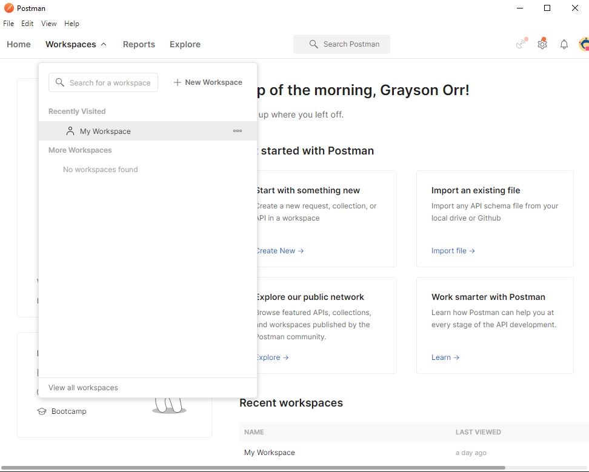
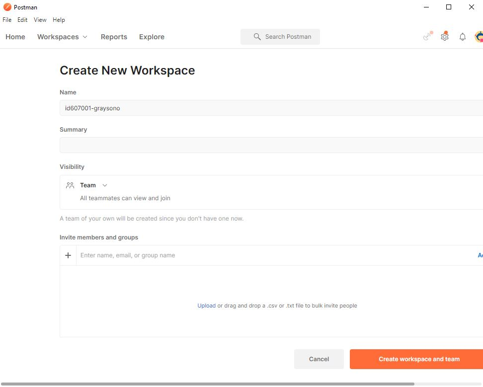
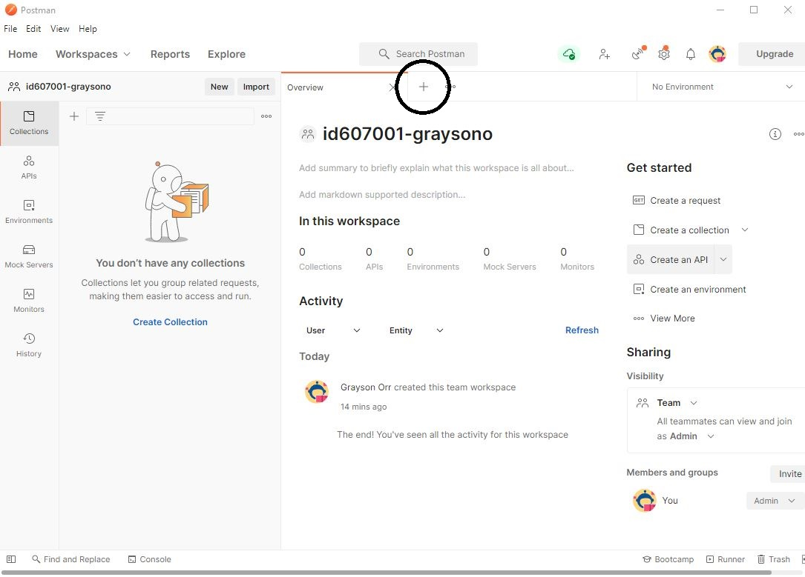

# 03: Express Basics and Postman

Lecture video can be found here - https://bit.ly/3SQvWHh

## Introduction to APIs

You consume **APIs (Application Programming Interfaces)** daily. They enable applications to communicate with each other, internally or externally.

The type of **API** you will develop and eventually consume is **REST** or **RESTful**. It is a set of architectural constraints. What it is not is a protocol or a standard. When a request is sent, it transfers a representation of the resource's state to the endpoint. This representation is delivered in one of many formats via **HTTP** such as **JSON**, **HTML**, etc.

### REST vs. RESTful

**REST** stands for **Representational State Transfer** and is a set of constraints. These constraints include client-server, stateless, uniform interface and cacheable. In essence, if an **API** adheres to these constraints, then the **API** is **RESTful**.

**Resource:** <https://blog.devmountain.com/what-is-the-difference-between-rest-and-restful-apis>

### Anatomy of a REST API

The following table describes the different **HTTP methods**:

| Operation | HTTP Method | Description                              |
| --------- | ----------- | ---------------------------------------- |
| Create    | POST        | Creates a new resource.                  |
| Read      | GET         | Provides read-only access to a resource. |
| Update    | PUT         | Updates an existing resource.            |
| Delete    | DELETE      | Removes a resource.                      |

There are a few others, but you will only be concerned with the four above.

## Express

**Express** is a lightweight **Node.js** web application framework that provides a set of robust features for creating applications.

Assume you have **Node.js** installed. Click [here](https://classroom.github.com/a/4w4EqOUZ) to create a new repository via **GitHub Classroom**. You will use this repository for the first assessment - **Project 1: REST API**. Clone the repository and open it in **Visual Studio Code**. 

Open a terminal in **Visual Studio Code** using the command <kbd>ctrl</kbd> + <kbd>~</kbd>.

You need to create a `package.json` file. This file will contain information about your **REST API** such as name, version, dependencies, etc.

To create a `package.json` file, run the following command:

```bash
npm init
```

It will prompt you to enter your **REST API's** name, version, etc. For now, you can press <kbd>enter</kbd> to accept the default values except for the following:

```bash
entry point: (index.js)
```

Enter `app.js` and press <kbd>enter</kbd>.

Install **Express** as a dependency. You can check whether it has been installed in `package.json`.

```bash
npm i express
```

Majority of the online **Node.js** examples use **CommonJS**. You are going to use **Modules** instead. In `package.json`, you need to add `"type": "module",` under `"main": "app.js",`.

**Resources:**

- <https://expressjs.com>
- <https://developer.mozilla.org/en-US/docs/Web/JavaScript/Guide/Modules>

## Prisma

**Prisma** is an open-source **Object-Relational Mapper (ORM)**. It enables you to interface between your database and application easily. **Prisma** supports database management systems like **SQLite**, **PostgreSQL**, **MySQL** and **Microsoft SQL Server**.

To get started, run the following commands:

```bash
npm i @prisma/client
npm i prisma --save-dev
npx prisma init
```

Check the `package.json` file to ensure you have installed `@prisma/client` and `prisma`.

### dotenv

You will see that when we initialised our Prisma, it created a file called `.env` - this is where we can store our **environment variables** or things we need to configure our app.

To use the `.env` file we need to install a package called `dotenv`:

```bash
npm i dotenv
```

Open the `.env` file in VS Code and add and `PORT` to it:

```
PORT=3000
```

### Schema

You will see a new directory called `prisma` in the root directory. In the `prisma` directory, you will see a new file called `schema.prisma`. This file tells **Prisma** how to connect to a database, generate a client and map your data from a database to your application.

Let us use the example code below. A schema is built up of three blocks - data sources, generators and models. Each block comprises a type, i.e., data source, a name, i.e., db and fields, i.e., provider and url.

In the `schema.prisma` file, add the following code:

```js
generator client {
  provider = "prisma-client-js"
}

datasource db {
  provider = "sqlite"
  url      = "file:./dev.db"
}

model Institution {
  id         Int          @id @default(autoincrement())
  name       String
  region     String
  country    String
  createdAt  DateTime     @default(now())
  departments Department[]
}

model Department {
  id            Int         @id @default(autoincrement())
  name          String
  institutionId Int
  createdAt     DateTime    @default(now())
  institution   Institution @relation(fields: [institutionId], references: [id])
}
```

### SQLite

You are going to use **SQLite** for the data source. The easy way to create an **SQLite** database is to download the **SQLite** command-line tool - <https://www.sqlite.com/2022/sqlite-tools-win32-x86-3390000.zip>. Run `sqlite3.exe` and run the following command:

```bash
.open dev.db
```

This command will create a new database file called `dev.db`. Copy and paste `dev.db` into the `prisma` directory.

### Migrations

You need to create a migration from the `prisma.schema` file and apply them to the `dev.db` file. To do this, run the following command:

```bash
npx prisma migrate dev
```

You will be prompt to enter a name for the new migration. Do not worry about this and press the <kbd>Enter</kbd> key. You will find the new migration in the `migrations` directory. Your database is in sync with your `schema.prisma` file.

**Resources:**

- <https://www.prisma.io/>

## Controllers

In the root directory, create a new directory called `controllers`. In this directory, create a new file called `institutions.js`. In `institutions.js`, you will write functions associated with the **HTTP methods** mentioned above.

To get **all** institutions, we create a function, and use `prisma.institution.findMany`.

```js
import { PrismaClient } from "@prisma/client";
const prisma = new PrismaClient();

const getInstitutions = async (req, res) => {
  try {
    const institutions = await prisma.institution.findMany({
      include: {
        departments: true,
      },
    });

    if (institutions.length === 0) {
      return res.status(200).json({ msg: "No institutions found" });
    }

    return res.json({ data: institutions });
  } catch (err) {
    return res.status(500).json({
      msg: err.message,
    });
  }
};
```

To create an institution, use `prisma.institution.create`. 

```js
// Sample HTTP POST request for Postman

/*
{
  "name": "Test",
  "region": "Test",
  "country": "Test"
}
*/
const createInstitution = async (req, res) => {
  try {
    const { name, region, country } = req.body; // destructuring object

    await prisma.institution.create({
      data: { name, region, country },
    });

    const newInstitutions = await prisma.institution.findMany({
      include: {
        departments: true,
      },
    });

    return res.status(201).json({
      msg: "Institution successfully created",
      data: newInstitutions,
    });
  } catch (err) {
    return res.status(500).json({
      msg: err.message,
    });
  }
};
```

To update an institution, use `prisma.institution.update`.

```js

// Sample HTTP PUT request for Postman

/*
{
  "name": "Test"
}
*/

const updateInstitution = async (req, res) => {
  try {
    const { id } = req.params;
    const { name, region, country } = req.body;

    let institution = await prisma.institution.findUnique({
      where: { id: Number(id) },
    });

    if (!institution) {
      return res
        .status(201)
        .json({ msg: `No institution with the id: ${id} found` });
    }

    institution = await prisma.institution.update({
      where: { id: Number(id) },
      data: { name, region, country },
    });

    return res.json({
      msg: `Institution with the id: ${id} successfully update`,
      data: institution,
    });
  } catch (err) {
    return res.status(500).json({
      msg: err.message,
    });
  }
};
```

To delete an institution, use `prisma.institution.delete`.

```js
const deleteInstitution = async (req, res) => {
  try {
    const { id } = req.params;

    const institution = await prisma.institution.findUnique({
      where: { id: Number(id) },
    });

    if (!institution) {
      return res
        .status(200)
        .json({ msg: `No institution with the id: ${id} found` });
    }

    await prisma.institution.delete({
      where: { id: Number(id) },
    });

    return res.json({
      msg: `Institution with the id: ${id} successfully deleted`,
    });
  } catch (err) {
    return res.status(500).json({
      msg: err.message,
    });
  }
};
```

To get a **SINGLE** institution, use `prisma.institution.findUnique`.

```js
const getInstitution = async (req, res) => {
  try {
    const { id } = req.params;

    const institution = await prisma.institution.findUnique({
      where: { id: Number(id) },
    });

    if (!institution) {
      return res
        .status(200)
        .json({ msg: `No institution with the id: ${id} found` });
    }

    return res.json({
      data: institution,
    });
  } catch (err) {
    return res.status(500).json({
      msg: err.message,
    });
  }
};
```

At the bottom of this file, add this code:

```js
export {
  getInstitution, // Get a single institution - returns an object
  getInstitutions, // Get all institutions - returns an array of objects
  createInstitution,
  updateInstitution,
  deleteInstitution
};
```

## Routes

In the root directory, create a new directory called `routes`. In this directory, create a new file called `institutions.js`. In `institutions.js`, you will create four routes and map them to the functions imported from `controllers/institutions.js`.

```javascript
import { Router } from "express";
const router = Router(); // Accessing the Router() object from express. It allows you to handle various requests

// Importing the four CRUD functions
import {
  getInstitution, // Get a single institution - returns an object
  getInstitutions, // Get all institutions - returns an array of objects
  createInstitution,
  updateInstitution,
  deleteInstitution,
} from "../controllers/institutions.js";

router.route("/").get(getInstitutions).post(createInstitution);
router.route("/:id").put(updateInstitution).delete(deleteInstitution).get(getInstitution);

// or

/*
// This is equivalent to above
router.route("/").get(getInstitutions)
router.route("/").post(createInstitution);
router.route("/:id").put(updateInstitution);
router.route("/:id").delete(deleteInstitution);
router.route("/:id").get(getInstitution);
*/

export default router; // You do not need to enclose router in curly braces
```

`export default router;` is an example of a default export. It means that when you import `routes/institutions.js` in `app.js`, you can use whatever name you want as the import name. Also, much like the name export, you can change the name using an alias. **Note:** Default exports are not enclosed in curly braces.

## App.js

Create a file called `app.js` in the root directory and add the following:

```javascript
import dotenv from "dotenv";
import express, { urlencoded, json } from "express";

import institutions from "./routes/institutions.js";

dotenv.config();

const app = express();

const BASE_URL = "api";

const PORT = process.env.PORT;

app.use(urlencoded({ extended: false }));
app.use(json());

app.use(`/${BASE_URL}/institutions`, institutions);

app.listen(PORT, () => {
  console.log(`Server is listening on port ${PORT}`);
});
```

Once you have added the lines of code, run your server - `node app.js`.

## Postman

**Postman** is an **API** development environment that allows you to design, mock and test your **APIs**. The examples below are using the **desktop client**. Alternatively, you can use the **web client**. The interface is much the same on both **clients**.

To use **Postman**, you need to create an account or sign in. There are two sign-in options - username/password and **Google**.


Once you sign in, it will navigate you to **Home**.


Next to the **Home** tab is the **Workspaces** dropdown. Click this and create a **New Workspace**.



Name your new workspace `id607001-<Your OP username>`. Once you have done this, click the **Create workspace and team** button in the bottom right-hand corner.



Click the **Go to Workspace** button.


You should see something like this. Click on the button to prepare to perform your first request.



# Formative Assessment

Before you start, create a new repository using the following link - <https://classroom.github.com/a/4w4EqOUZ>. You will use this for **Project 1: Node.js REST API**. Before you start, create a new branch called **formative-assessments**. 

If you get stuck on any of the following tasks, feel free to use **ChatGPT** permitting, you are aware of the following:

- If you provide **ChatGPT** with a prompt that is not refined enough, it may generate a not-so-useful response
- Do not trust **ChatGPT's** responses blindly. You must still use your judgement and may need to do additional research to determine if the response is correct
- Acknowledge that you are using **ChatGPT**. In the **README.md** file, please include what prompt(s) you provided to **ChatGPT** and how you used the response(s) to help you with your work

## Task 1

Create an **Express** application and add the code above.

## Task 2 (Independent Research)

In **Postman**, perform a **POST**, **GET**, **PUT** and **DELETE** request.

You can find the sample video here - https://bit.ly/3YsrNKH

## Task 3 (Independent Research)

Implement a new controller and route to get a specific institution. You will pass the an id via a route parameter like the **PUT** and **DELETE** examples, and fetch that single record from the database. Return the record, or an error message if not found. 

## Task 4 (Independent Research)

In this task, you will setup **Nodemon** which is a tool that automatically restarts a **Node.js** application whenever a change is made to the source code. Install **Nodemon** by running the following command - `npm install nodemon --save-dev`. In the `package.json` file, add a new script to run the application using **Nodemon**.

## Task 5 (Independent Research)

In this task, you will setup **Prisma Studio** which is a visual database editor for **Prisma**. This allows you to **CRUD** data without having to write **SQL** queries or use a **CLI**. Install **Prisma Studio** by running the following command - `npm install @prisma/studio --save-dev`. In the `package.json` file, add a new script to run **Prisma Studio**.

# Formative Assessment Submission

Create a new pull request and assign **grayson-orr** to review your submission. Please don't merge your own pull request.
