# 03: Node.js REST API 1

## Introduction to APIs

You consume **APIs (Application Programming Interfaces)** daily. They enable applications to communicate with each other, internally or externally.

The type of **API** you will develop and eventually consume is **REST** or **RESTful**. It is a set of architectural constraints. What it is not is a protocol or a standard. When a request is sent, it transfers a representation of the resource's state to the endpoint. This representation is delivered in one of many formats via **HTTP** such as **JSON**, **HTML**, etc.

### REST vs. RESTful

**REST** stands for **Representational State Transfer** and is a set of constraints. These constraints include client-server, stateless, uniform interface and cacheable. In essence, if an **API** adheres to these constraints, then the **API** is **RESTful**.

**Resource:** <https://blog.devmountain.com/what-is-the-difference-between-rest-and-restful-apis>

### Anatomy of a REST API

The following table describes the different **HTTP methods**:

| Operation | HTTP Method | Description                              |
| --------- | ----------- | ---------------------------------------- |
| Create    | POST        | Creates a new resource.                  |
| Read      | GET         | Provides read-only access to a resource. |
| Update    | PUT         | Updates an existing resource.            |
| Delete    | DELETE      | Removes a resource.                      |

There are a few others, but you will only be concerned with the four above.

---

## Express

**Express** is a lightweight **Node.js** web application framework that provides a set of robust features for creating applications.

Assume you have **Node.js** installed. Click [here](https://classroom.github.com/a/hWjmBeNq) to create a new repository via **GitHub Classroom**. You will use this repository for the first assessment - **Project 1: REST API**. Clone the repository and open it in **Visual Studio Code**. 

Open a terminal in **Visual Studio Code** using the command <kbd>ctrl</kbd> + <kbd>~</kbd>.

You need to create a `package.json` file. This file will contain information about your **REST API** such as name, version, dependencies, etc.

To create a `package.json` file, run the following command:

```bash
npm init
```

It will prompt you to enter your **REST API's** name, version, etc. For now, you can press <kbd>enter</kbd> to accept the default values except for the following:

```bash
entry point: (index.js)
```

Enter `app.js` and press <kbd>enter</kbd>.

Install **Express** as a dependency. You can check whether it has been installed in `package.json`.

```bash
npm install express
```

Majority of the online **Node.js** examples use **CommonJS**. You are going to use **Modules** instead. In `package.json`, you need to add `"type": "module",` under `"main": "app.js",`.

**Resources:**

- <https://expressjs.com>
- <https://developer.mozilla.org/en-US/docs/Web/JavaScript/Guide/Modules>

---

## MongoDB

**MongoDB** is cross-platform, i.e., **Windows**, **Linux** and **macOS**, document-oriented database that works on idea of collections and documents.

### Database

It can be defined as a container for your **collections**. Typically, a **MongoDB** server has multiple **databases**.

### Collection

A **collection** is a group of **documents**. You can think of this like a **table** in a **MySQL** or **MariaDB**. **Collections** do not enforce a **schema**.

### Document

A **document** is a set of **key-value** similar to **JSON** or a **JavaScript** **object**. **Documents** have a **dynamic** **schema** meaning **documents** in the same **collection** do not need to have the same **fields** or structure.

### Terminology

It is important to understand the terminology:

| RDBMS       | MongoDB             |
| ----------- | ------------------- |
| Database    | Database            |
| Table       | Collection          |
| Row         | Document            |
| Column      | Field               |
| Join        | Embedded documents  |
| Primary key | Primary/default key |

**Resources:**

- <https://www.mongodb.com>
- <https://docs.mongodb.com/manual/tutorial>
- <https://www.youtube.com/watch?v=RGfFpQF0NpE>

---

## MongoDB Atlas

In this course, you will primarily use **cloud-based** services, i.e., **MongoDB Atlas** and **Heroku**.

To start using **MongoDB Atlas**, sign up [here](https://www.mongodb.com/cloud/atlas/signup).

Once you have done this, it will navigate you to **Projects**. As you see, you do not have any **projects**. Click the **New Project** button.

[](04-node-js-rest-api-2.md) 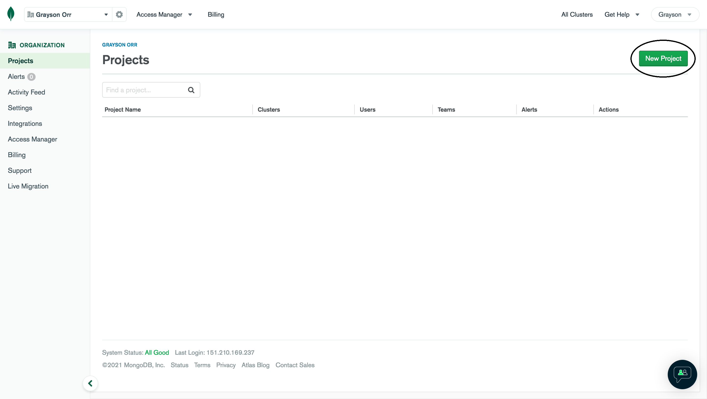 

Name your **project** the same as your **Postman** **workspace**, i.e., `id607001-<Your OP username>`, then click the **Next** button.

[](04-node-js-rest-api-2.md) 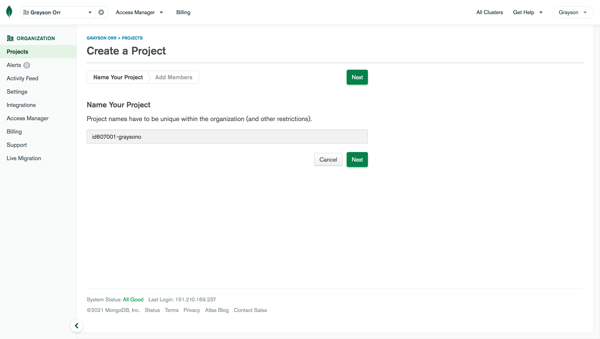 

By default, you will set to the **Project Owner**. Click the **Create Project** button.

[](04-node-js-rest-api-2.md) 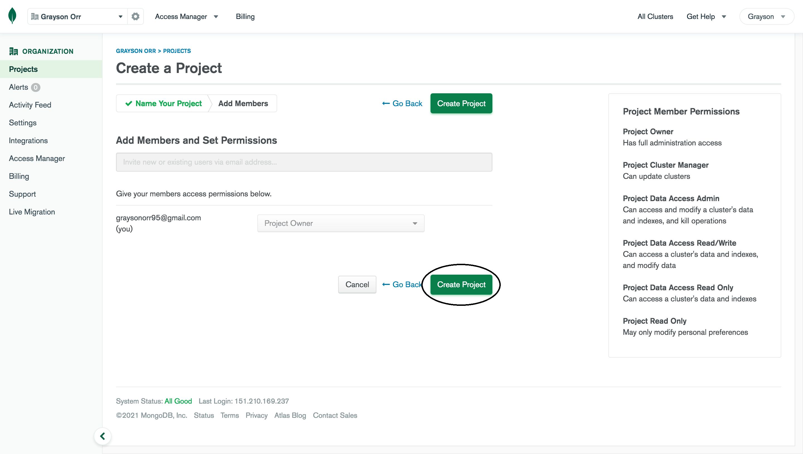

To create a new **database**, click the **Build a Database** button.

[](04-node-js-rest-api-2.md) 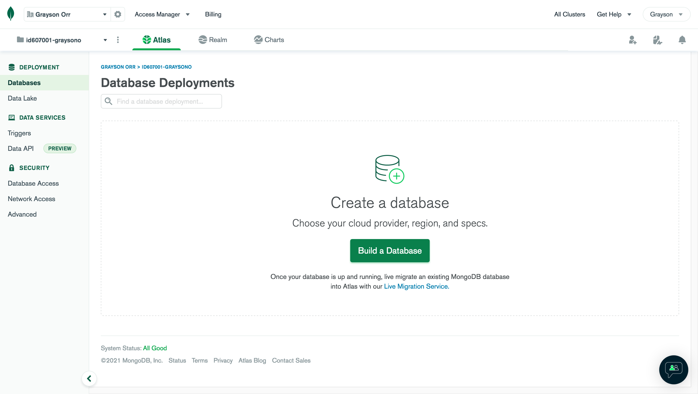

Click the **Shared** option then the **Create** button.

[](04-node-js-rest-api-2.md) 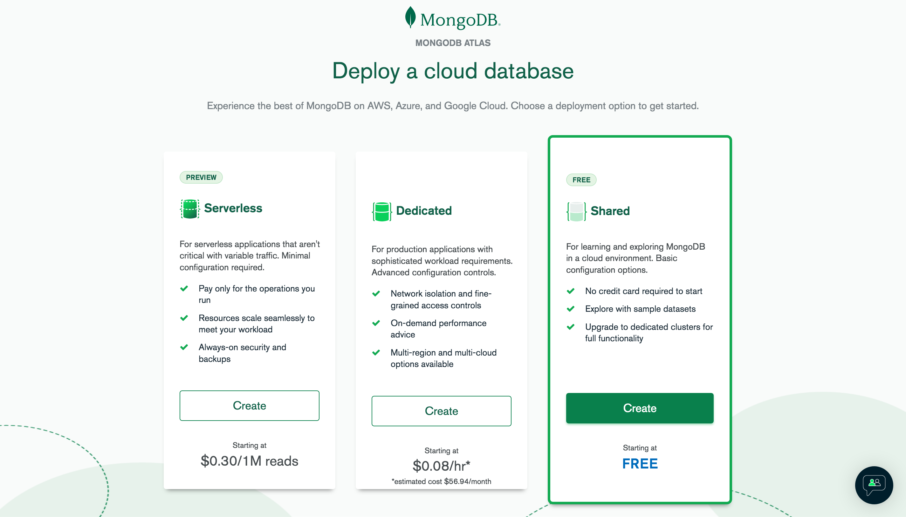

Do not change the default configuration. Click the **Create Cluster** button.

[](04-node-js-rest-api-2.md) 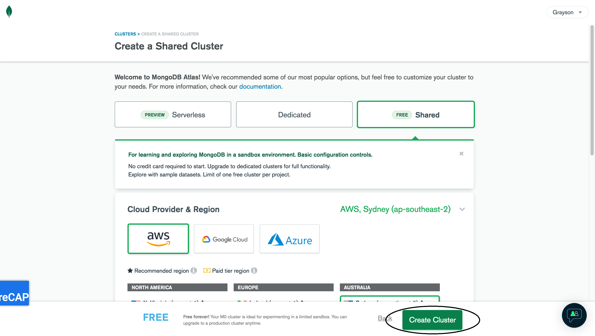

You will be asked to create a **database** user. Provide a **username** and **password**. Do not include the **@** special character in your **password**.

[](04-node-js-rest-api-2.md) 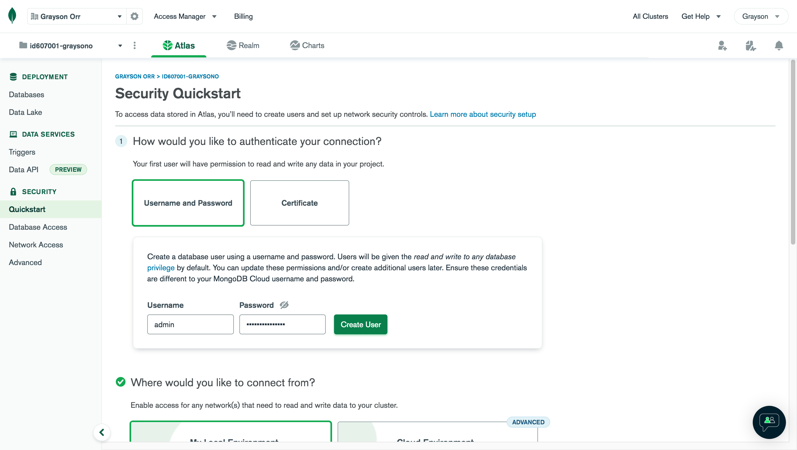

Also, you will be asked to provide your **IP address**. **Note:** You will need to change it when working between home and campus. If you wish, you can accept all **IP addresses**, i.e., `0.0.0.0/0`.

[](04-node-js-rest-api-2.md) 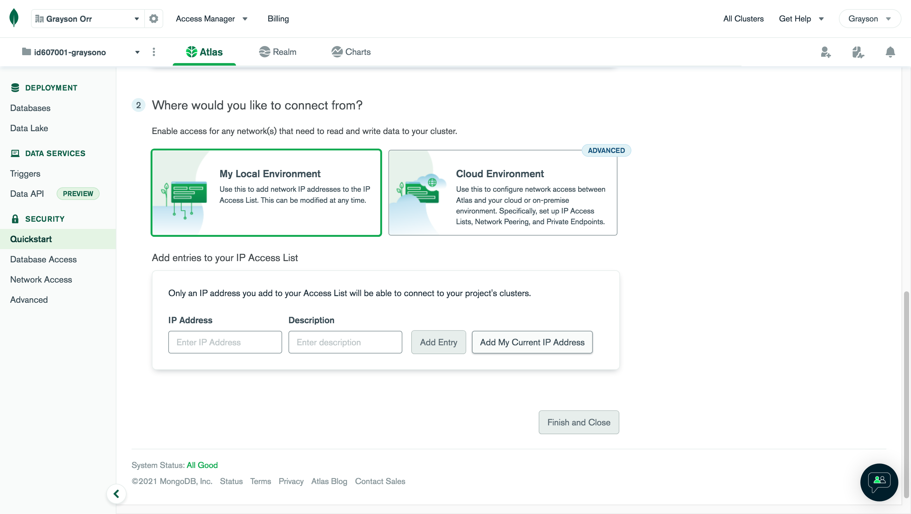

Once you have added your **IP address**, click the **Finish and Close** button.

[](04-node-js-rest-api-2.md) 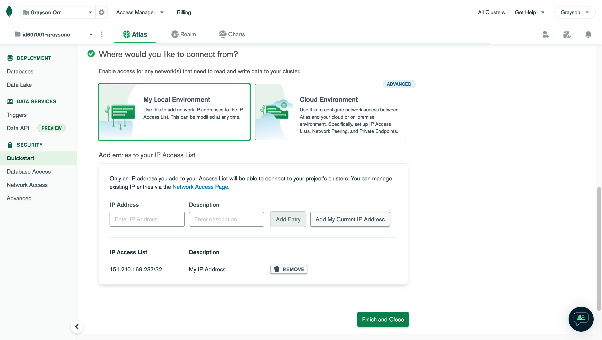

You will be presented with a modal congratulating you on setting up access rules. **Note:** You can change these access rules at any time. Click the **Go to Database** button.

[](04-node-js-rest-api-2.md) 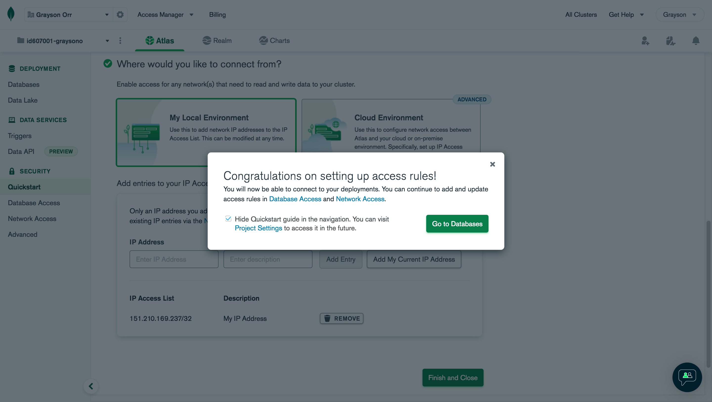

---

## Environment variables

In the root directory, create a new file called `.env`. It is used to store your application's environment variables. You will look at to access these variables soon.

Go back to **MongoDB Atlas**. In **Database Deployments**, click the **Connect** button.

[](04-node-js-rest-api-2.md) 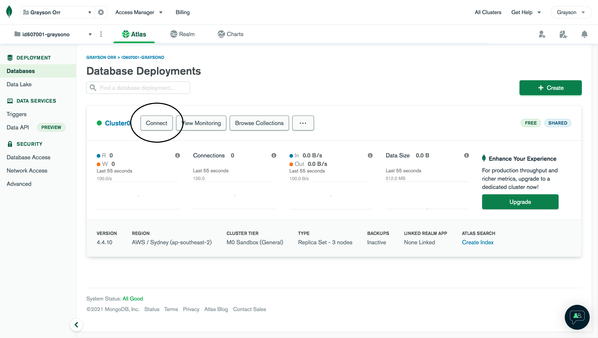

Click the **Connect your application** option. It will connect your application to your cluster.

[](04-node-js-rest-api-2.md) 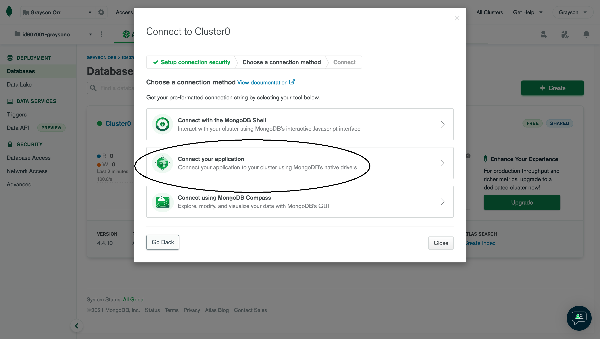

Copy the connection string.

[](04-node-js-rest-api-2.md) 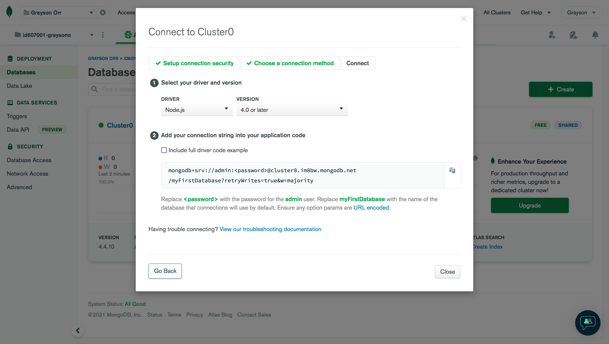

Go back to `.env` and add the following environment variable:

```bash
MONGO_URI_DEV=
MONGO_URI_TEST=
NODE_ENV=development
```

**Note:** You will need to add your database user's **password**.

---

## Mongoose

**Mongoose** provides a schema-based solution to model your application's data. It includes many useful features such as type casting, validation, querying and much more.

### Connection

In the root directory, create a new directory called `db`. In `db`, create a new file called `connection.js`. In this file, add the following:

```javascript
import mongoose from "mongoose";

const conn = (url) => mongoose.connect(url);

export default conn;
```

- `import mongoose from "mongoose"` - To use **Mongoose**, run the command: `npm install mongoose`.
- `connect` - It allows you to connect to a **MongoDB Atlas** **cluster**.

You will need to add a few things to `app.js`:

```javascript
import dotenv from "dotenv";
import express from "express";

import conn from "./db/connection.js";

import institutions from "./routes/institutions.js";

dotenv.config(); 

const app = express();

const PORT = process.env.PORT || 3000;
const DB =
  process.env.NODE_ENV === "development"
    ? process.env.MONGO_URI_DEV
    : process.env.NODE_ENV === "testing"
    ? process.env.MONGO_URI_TEST
    : process.env.MONGO_URI_PROD; // You will set this in Heroku instead of in .env

app.use(express.urlencoded({ extended: false }));
app.use(express.json());

app.use("/api/institutions", institutions);

const start = async () => {
  try {
    await conn(DB);
    console.log(`Server is using the ${process.env.NODE_ENV} database`);
    app.listen(PORT, () => console.log(`Server is listening on port ${PORT}`));
  } catch (error) {
    console.log(error)
  }
};

start();
```

- `import dotenv from "dotenv"` - To use **dotenv**, run the command: `npm install dotenv`.
- `import conn from "./db/connection.js"` - You need to import `conn`. It will be called in `start()`.
- `dotenv.config()` - It will read your `.env` file, parse the contents, assign it to `process.env` and return an object.
- `start()` - It will connect to your **MongoDB Atlas** **cluster** and start a **development server**.

**Resources:**

- <https://mongoosejs.com>
- <https://www.npmjs.com/package/mongoose>
- <https://www.npmjs.com/package/dotenv>

### Schema and model

The start point with **Mongoose** is the `Schema`. Each **schema** is mapped to a **collection** and defines the shape of a **document** within that **collection**.

In the root directory, create a new directory called `models`. In this directory, create a new file called `institutions.js`. In `institutions.js`, add the following:

```javascript
import mongoose from "mongoose";

const institutionsSchema = new mongoose.Schema({
  name: {
    type: String,
  },
});

export default mongoose.model("Institution", institutionsSchema);
```

- `mongoose.Schema` - Each key in `institutionsSchema` defines a property in a **document** which will be cast to a `SchemaType`, i.e., `name` will be cast to the `String` `SchemaType`.
- `mongoose.model` - A constructor compiled from a `Schema` definition.  An instance of a model is called a **document**. Models are responsible for creating and reading documents from a **MongoDB database**.

**Resources:**

- <https://mongoosejs.com/docs/guide.html#schemas>
- <https://mongoosejs.com/docs/models.html>

---

## Postman

**Postman** is an **API** development environment that allows you to design, mock and test your **APIs**. The examples below are using the **desktop client**. Alternatively, you can use the **web client**. The interface is much the same on both **clients**.

To use **Postman**, you need to create an account or sign in. There are two sign-in options - username/password and **Google**.


Once you sign in, it will navigate you to **Home**.


Next to the **Home** tab is the **Workspaces** dropdown. Click this and create a **New Workspace**.


To keep things consistent with the **MongoDB Atlas** database, you will create next week, name your new workspace `id607001-<Your OP username>`. Once you have done this, click the **Create workspace and team** button in the bottom right-hand corner.


Click the **Go to Workspace** button.

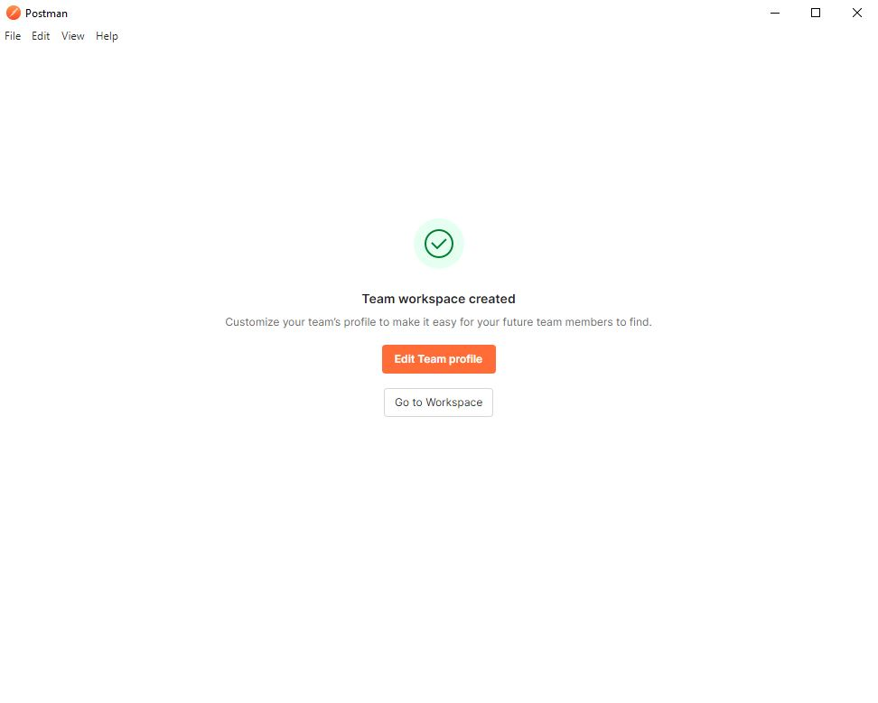

You should see something like this:

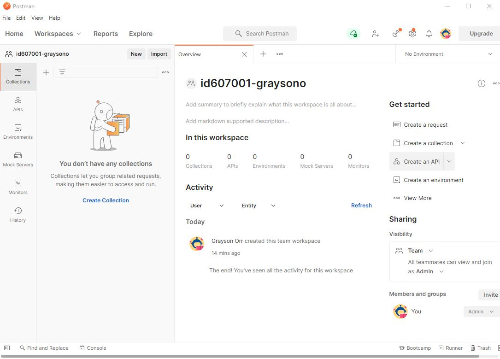

Click the **+** button next to the **Overview** tab. You will look at how to send a request soon.

---

## Controller

In the root directory, create a new directory called `controllers`. In this directory, create a new file called `institutions.js`. In `institutions.js`, you will write functions associated with the **HTTP methods** mentioned above.

Import the **model** from `models/institutions.js`.

```javascript
import Institution from "../models/institutions.js";
```

To get **all** institutions, use `Institution.find({})`. The `{}` inside `Institution.find()` is used to return **all** institutions.

```javascript
const getInstitutions = async (req, res) => {
  try {
    const institutions = await Institution.find({});
    return res.status(200).json({ success: true, data: institutions });
  } catch (err) {
    return res.status(500).json({
      msg: err.message
    });
  }
};
```

To create an institution, use `Institution.create(req.body)`. 

```javascript
const createInstitution = async (req, res) => {
  try {
    await Institution.create(req.body);
    const newInstitutions = await Institution.find({});
    return res.status(201).json({ success: true, data: newInstitutions });
  } catch (err) {
    return res.status(500).json({
      msg: err.message
    });
  }
};
```

Time to test it out. Firstly, start the development server, then go to **Postman**. Enter the URL - <http://localhost:3000/api/institutions> and data, then perform a **POST** request. **Note:** `req.body` is the payload sent with the request, i.e., `{ "name": "Otago Polytechnic" }`.

The response contains `success` and `data`. `data` contains the **document's** `id`, `name` and `__v` (version).

[](04-node-js-rest-api-2.md) 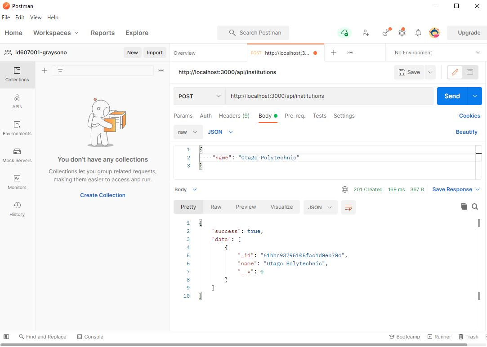

If you want to view the **collections**, go to **MongoDB Atlas** and click the **Browse Collections** button.

[](04-node-js-rest-api-2.md) 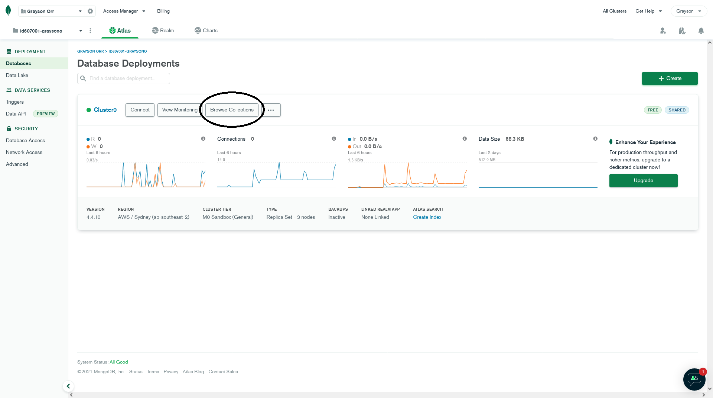


**Note:** `student-management` is the name of the **database**.

[](04-node-js-rest-api-2.md) 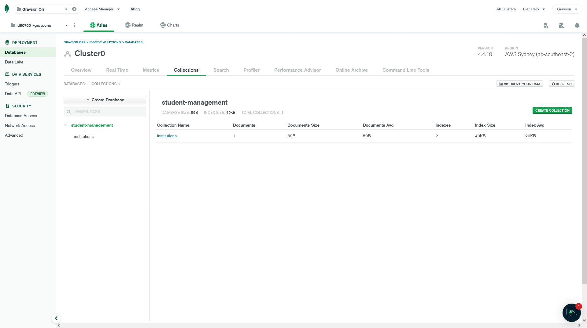

To update an institution, use `Institution.findByIdAndUpdate(id, req.body.name)`.

```javascript
const updateInstitution = async (req, res) => {
  try {
    const { id } = req.params;
    const institution = await Institution.findByIdAndUpdate(id, req.body);

    if (!institution) {
      return res.status(404).json({
        success: false,
        msg: `No institution with the id ${id}`,
      });
    }

    const newInstitutions = await Institution.find({});
    return res.status(200).json({ success: true, data: newInstitutions });
  } catch (err) {
    return res.status(500).json({
      msg: err.message
    });
  }
};
```

**PUT** request example:

[](04-node-js-rest-api-2.md) 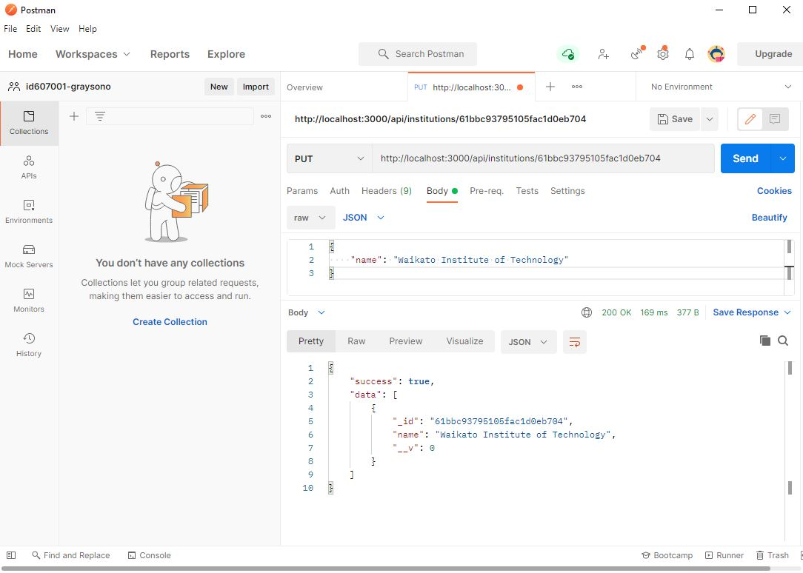

The `id` (destructured) or `req.params.id` (not destructured) is the 24 characters string after `http://localhost:3000/api/institutions/`.

```javascript
const deleteInstitution = async (req, res) => {
  try {
    const { id } = req.params;
    const institution = await Institution.findByIdAndRemove(id);

    if (!institution) {
      return res.status(404).json({
        success: false,
        msg: `No institution with the id ${id}`,
      });
    }

    const newInstitutions = await Institution.find({});
    return res.status(200).json({ success: true, data: newInstitutions });
  } catch (err) {
    return res.status(500).json({
      msg: err.message
    });
  }
};
```

**DELETE** request example:

[](04-node-js-rest-api-2.md) 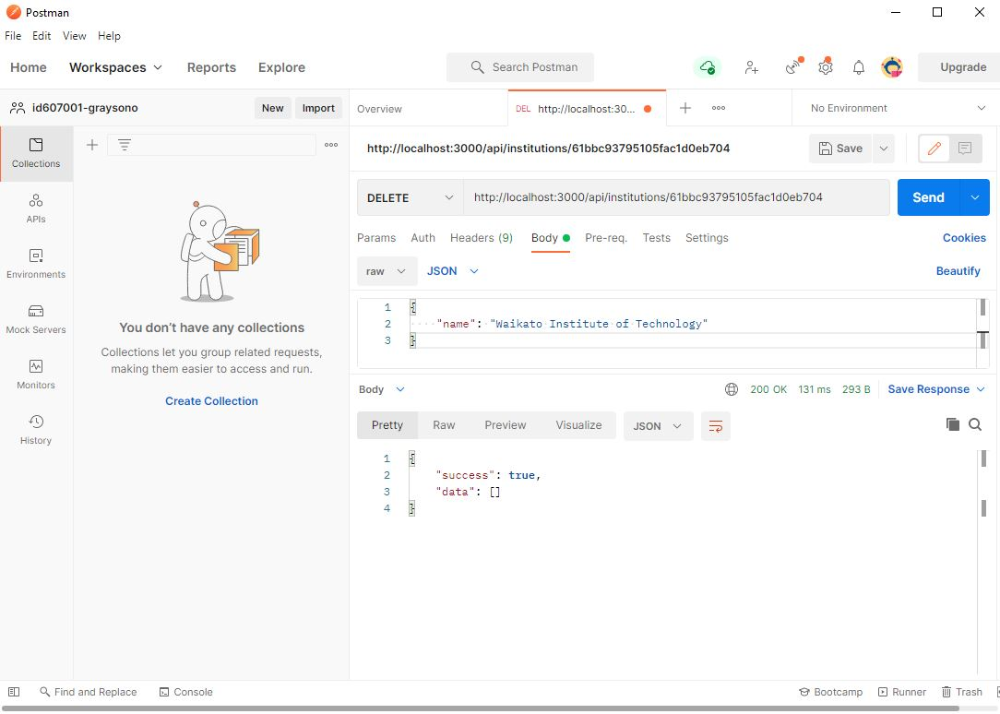

Exports functions remain unchanged.

```javascript
export {
  getInstitutions,
  createInstitution,
  updateInstitution,
  deleteInstitution,
};
```

**Resources:**

- <https://mongoosejs.com/docs/api.html#model_Model.find>
- <https://mongoosejs.com/docs/api.html#model_Model.findByIdAndUpdate>
- <https://mongoosejs.com/docs/api.html#model_Model.findByIdAndRemove>

---

## Routes

In the root directory, create a new directory called `routes`. In this directory, create a new file called `institutions.js`. In `institutions.js`, you will create four routes and map them to the functions imported from `controllers/institutions.js`.

```javascript
import { Router } from "express";
const router = Router(); // Accessing the Router() object from express. It allows you to handle various requests

// Importing the four CRUD functions
import {
  getInstitutions,
  createInstitution,
  updateInstitution,
  deleteInstitution,
} from "../controllers/institutions.js";

router.route("/").get(getInstitution).post(createInstitution)
router.route("/:id").put(updateInstitution).delete(deleteInstitution)

export default router; // You do not need to enclose router in curly braces
```

`export default router;` is an example of a default export. It means that when you import `routes/institutions.js` in `app.js`, you can use whatever name you want as the import name. Also, much like the name export, you can change the name using an alias. **Note:** Default exports are not enclosed in curly braces.

---

## Final thoughts

As you extend your **REST API**, you will find that you are duplicating a lot of code, particularly in your `controllers`. I encourage you to explore and come up with a solution. However, if you are not confident in doing so, you will look more into this in **IN608: Intermediate Application Development** next semester.

---

## Formative assessment

### Submission

You must submit all program files via **GitHub Classroom**. If you wish to have your code reviewed, message the course lecturer on **Microsoft Teams**. 

### Getting started

Open your repository in **Visual Studio Code**. Create a student management system **REST API** using **Node.js**, **Express** and **MongoDB Atlas** Implement the concepts as described in the lecture notes above.

---

## Additional assessment tasks

### Get an institution by its id

