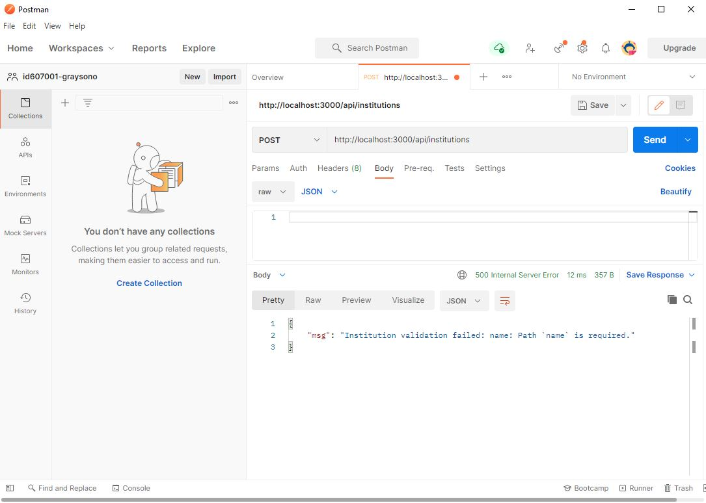
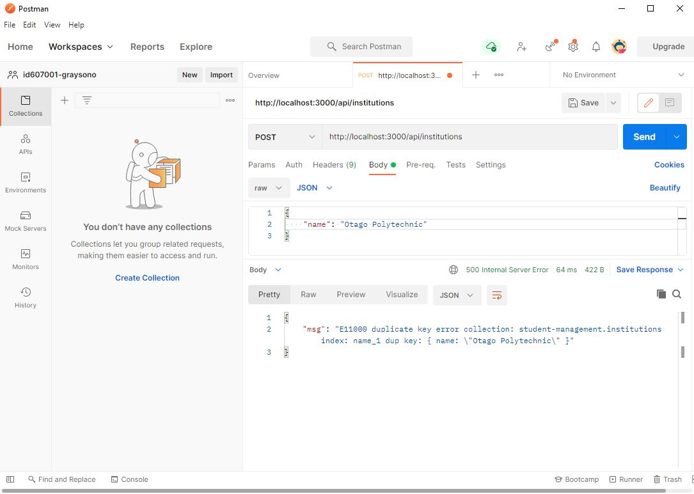
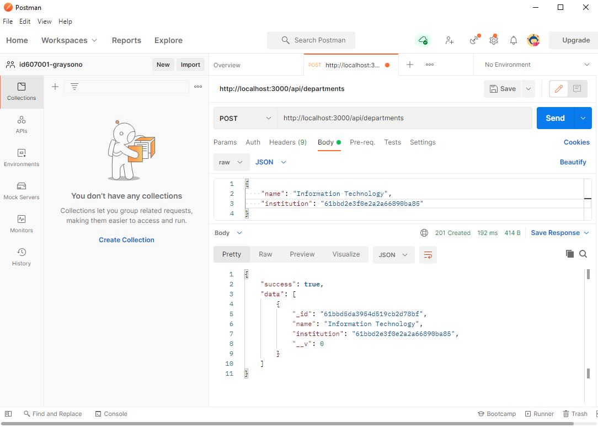
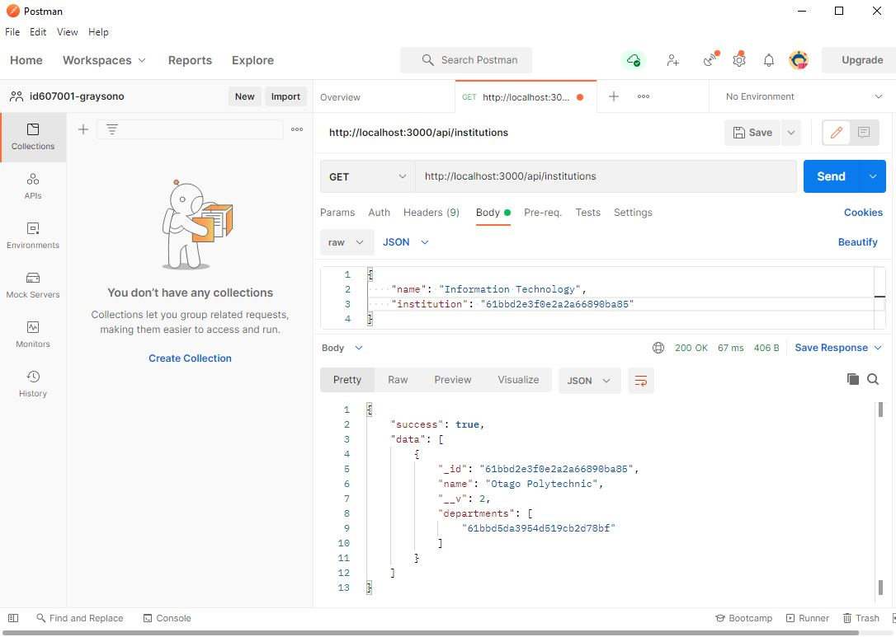

# 04: Node.js REST API 2

## Validation

**Server-side** validation occurs after a request has been sent. It is used to validate the data before it is saved to the **database** and subsequently consumed by a **client-side** application. If the data does not validate, a response is sent back with the corrections that need to be made. Validation is a security measure and prevents attacks by malicious users. Improper validation is one of the main cause of security vulnerabilities such as **SQL injection**, **cross-site scripting** and **header injection**.

Here is an example of how you can validate your **collection's** **fields**:

```javascript
import mongoose from "mongoose";

const institutionsSchema = new mongoose.Schema({
  name: {
    type: String,
    required: true,
    unique: true,
    maxlength: 100,
  },
});

export default mongoose.model("institution", institutionsSchema);
```

Here is a **POST** request example:

[](04-node-js-rest-api-2.md) 


Here is another **POST** request example: The `unique` option is not a validator. It is used to build **MongoDB** unique indexes.

[](04-node-js-rest-api-2.md) 

**Resources:** 
- <https://mongoosejs.com/docs/validation.html>
- <https://en.wikipedia.org/wiki/SQL_injection>
- <https://en.wikipedia.org/wiki/Cross-site_scripting>
- <https://en.wikipedia.org/wiki/HTTP_header_injection>

## Relationships

The following example demonstrates a relationship between `institution` and `department`.

Here you are referencing `institution`. In a nutshell, you are saying a department can belong to an institution. **Note:** You will need to create a new file called `departments.js` in the `models` directory.

```javascript
import mongoose from "mongoose";

const departmentsSchema = new mongoose.Schema({
  name: {
    type: String,
    required: true,
    maxlength: 50,
  },
  institution: {
    type: mongoose.Schema.Types.ObjectId,
    ref: "institution",
  },
});

export default mongoose.model("department", departmentsSchema);
```

Here you are referencing `department`. You are saying an institution can have many departments.

```javascript
import mongoose from "mongoose";

const institutionsSchema = new mongoose.Schema({
  name: {
    type: String,
    required: true,
    unique: true,
    maxlength: 100,
  },
  departments: [
    {
      type: mongoose.Schema.Types.ObjectId,
      ref: "department",
    },
  ],
});

export default mongoose.model("institution", institutionsSchema);
```

In the `controllers` directory, create a new file called `departments.js`. **Note:** The example below does not include `updateDepartment` and `deleteDepartment`.

```javascript
import Department from "../models/departments.js";
import Institution from "../models/institutions.js";

const getDepartments = async (req, res) => {
  try {
    const departments = await Department.find({});
    return res.status(200).json({ success: true, data: departments });
  } catch (err) {
    return res.status(500).json({
      msg: err.message
    });
  }
};

const createDepartment = async (req, res) => {
  try {
    const department = new Department(req.body);
    await department.save();

    // Find a institution by its id, then push the created department to its list of departments.
    const institution = await Institution.findById({
      _id: department.institution,
    });
    institution.departments.push(department);
    await institution.save();

    const newDepartments = await Department.find({});
    return res.status(201).json({ success: true, data: newDepartments });
  } catch (err) {
    return res.status(500).json({
      msg: err.message
    });
  }
};

export { getDepartments, createDepartment };
```

**Note:** You will create the appropriate **routes** for these functions.

Here is a **POST** request example:

[](04-node-js-rest-api-2.md) 

Here is a **GET** request example:

[](04-node-js-rest-api-2.md) 

**Note:** You can see an institution's list of departments.

**Resource:** <https://docs.mongodb.com/manual/tutorial/model-referenced-one-to-many-relationships-between-documents>

## Formative assessment

In this **in-class activity**, you will use your previous **in-class activity** plan to create a **REST API** for the **Project 1: REST API** assessment. In addition, you will explore how to enable **Cross-origin resource sharing (Cors)** and **Helmet**.

### Submission

You must submit all program files via **GitHub Classroom**. Here is the URL to the repository you will use for this **in-class activity** – <https://classroom.github.com/a/hWjmBeNq>. If you wish to have your code reviewed, message the course lecturer on **Microsoft Teams**. 

### Getting started

Open your repository in **Visual Studio Code**. Create a **REST API** using **Express** and **MongoDB Atlas** as described in the lecture notes above.

## Additional assessment tasks

### Cross-origin resource sharing (Cors)

Carefully read the first resource below. It will provide you with an excellent explanation of how **cross-origin resource sharing** works. Using the second resource below, implement simple usage (enable all cors requests) when in a **development environment**. 

**Resources:**

- <https://developer.mozilla.org/en-US/docs/Web/HTTP/CORS>
- <https://www.npmjs.com/package/cors>

### Helmet

**Helmet** is a dependency that helps you secure you **REST API** by setting various **HTTP headers**. These are an important part of **HTTP** and provide metadata about a request or response. **HTTP headers** can leak sensitive information about your **REST API** such as **X-Powered-By**. This header informs the browser which server vendor and version you are using, i.e., **Express**. It makes your **REST API** a prime target where this information can be cross-referenced with publicly known vulnerabilities. Using the resource below, implement **helmet**.

**Resource:** <https://www.npmjs.com/package/helmet>

### Final words

Please review your changes against the **Project 1: REST API** assessment document and marking rubric.
