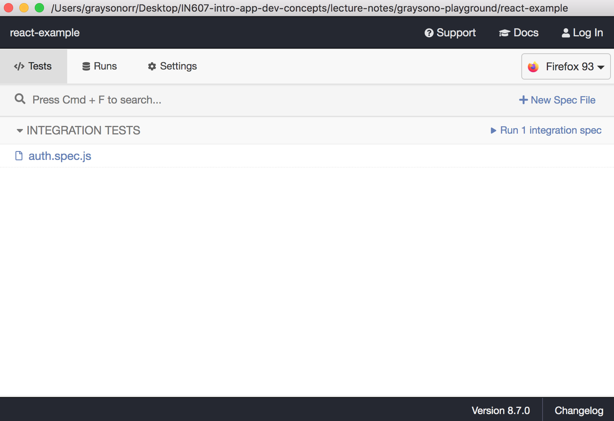
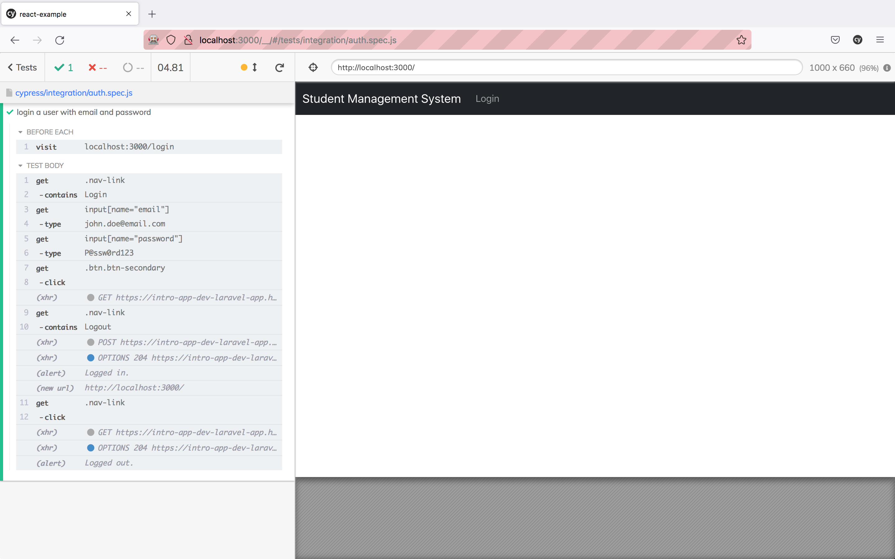

# React 5 - Cypress

## What is end-to-end (e2e) testing?

In this lecture, you will explore **e2e** testing. You should be familiar with the concept of **unit** and **API** testing, where you tend to test your application's backend code. What if you want to test your application's frontend code? It is where **e2e** testing comes in. Before we look at **Cypress** and an example, you need to understand what **e2e** testing is.

**E2e** testing is a software testing practice that tests an application's (usually something visual) flow from start to end. It serves the purpose of simulating a real-world scenario, i.e., logging into an application, creating a new record, then logging out of an application. It ensures its components, i.e., login form for integration, i.e., what happens when a user logs in successfully and data integrity, i.e., valid user inputs.

## What is Cypress?

**Cypress** is a **JavaScript** testing framework that allows you to write a variety of different tests, i.e., **unit**, **integration**, **e2e**.

You can read a little bit more about how **Cypress** works here - <https://www.cypress.io/how-it-works>

### Installing Cypress

You can install **Cypress** via **npm**, but it is important to install it as a development dependency. Development dependencies do not serve many purposes in production, and they will be excluded from the final build. It is the same for dependencies that handle linting and code formatting.

To install **Cypress**, run the following command:

```md
npm i --dev cypress
```

It might take around 30 seconds to one minute to install. It is why you do not want it to be a regular dependency.

In `package.json`, you should see a new block called `devDependencies`.

In the `scripts` block, add the following:

`"cypress": "cypress open"`

Your `scripts` block should look like the following:

```md
"scripts": {
    "start": "react-scripts start",
    "build": "react-scripts build",
    "test": "react-scripts test",
    "eject": "react-scripts eject",
    "cypress": "cypress open"
},
```

### Example Time

Lets now look at an example. Open `graysono-playground/react-example` in **Visual Studio Code**. You are going to use the login/logout example from the previous session. **Note:** this example already has **Cypress** as a development dependency.

Run the following command:

```md
npm run cypress
```

If it is the first time running this command, it will create a new directory called `cypress`. The directory is located above `node_modules` in the root directory of your **React** application. It will also create a `cypress.json`. You will not be using this file, so feel free to ignore it (do not delete it).

In `cypress/integration`, there are sample tests that you can run to see how **Cypress** tests work. After you have tried some out, delete both directories - `1-getting-started` and `2-advanced-examples`.

Create a new test file called `auth.spec.js`. `spec` is the extension for tests. The **Cypress** test runner will look for any file in the `integration` directory with the extension `spec.js`. Alternatively, you can use `test.js`.

In `auth.spec.js`, add the following:

```js
beforeEach(() => {
    /**
     * In your Project 2: React CRUD, you may want to use your 
     * Heroku application's URL. You can change it after you 
     * have figured out how to deploy your React application
     * to Heroku.
     */
    cy.visit('localhost:3000/login'); 
});

// The description of the test
it('login a user with email and password', () => {
    cy.get('.nav-link').contains('Login'); // The nav link text contains "Login"
    cy.get('input[name="email"]').type('john.doe@email.com'); // Find the input with the name "email", then type a value
    cy.get('input[name="password"]').type('P@ssw0rd123'); // Find the input with the name "password", then type a value
    cy.get('.btn.btn-secondary').click(); // Find the element with the class .btn.btn-secondary, then click it
    cy.get('.nav-link').contains('Logout'); // The nav link text contains "Logout"
    cy.get('.nav-link').click(); // Log the user out
});
```

It is a sample test to get you started. Please read the comments carefully. The tests are endless, and I do not expect you to cover every use case for your application. As mentioned in the **Project 2: React CRUD** assessment document, focus on the authentication. Think about how you would test if the user's credentials are incorrect.

Now you have a test, how do you go about running it. If you have not already, run the command `npm run cypress`. It will open and navigate you to a new window. You see the following:



Click on `auth.spec.js`. It will open a new browser. My default browser is **Firefox** but you may choose **Chrome**, **Edge**, etc.

It will run all the tests (one at the moment) in `auth.spec.js`. As it executes each condition, you should see it live on the left-hand side.



If you hover over each condition, it shows you a **DOM** snapshot at that specific point. It can help you debug an issue that may have occurred during testing.